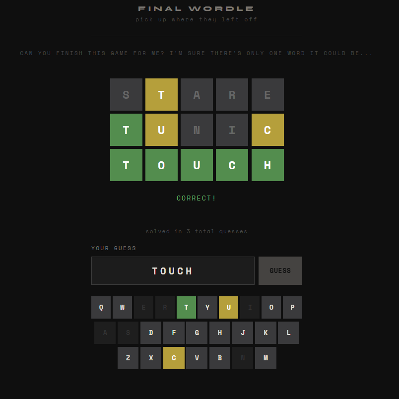

The only person brave enough to make a new version of Wordle!

## Okay but really,

does the universe really need yet *another* version of the iconic Wordle? 
Well I don't speak for the universe (yet), but I did actually want something else. Whenever I sat down to attempt this word puzzle, I was always a bit miffed by the ambiguity of it all. Oh sure, consider every possible word in the English language - or actually in some word-bank with who knows what all - and then make a decision that drives you to fewer and fewer possibilities. It felt a bit like solving a Rubiks Cube. With far too many options to consider, you have to learn a few tricks. And I *do* think this is a brilliant puzzle, as is a Rubiks, but it doesn't scratch the same itch for me as making a few awesome logic jumps and crashing into **The Answer**. 

Indeed I have experienced this feeling when playing Wordle. Or more precisely, someone *else's* Wordle. On a few occasions, a friend has leaned over to me with a tricky set that had stumped them, with only one guess remaining! And this is where I felt that lovely zing. I didn't have to worry about getting there efficiently, they of course had already fumbled the bag. I just had to be clever enough to think up "ATOLL!"

Or, maybe I'm just lazy and like the very end of the Wordle game!

This version of Wordle is one I've had in the back of my mind for a while, so I got to it today. I've released a preliminary design using the official Wordle wordbanks! This current puzzle algorithm picks a word at random from the possible answer list, and then uses a limited solver to attempt to solve the puzzle until only *one possible answer* remains, for you to guess! I've also tweaked the difficulty so that super easy puzzles don't get through... but there currently is no limit on how hard the puzzle can be! Because it's still in testing mode, I've also allowed for anyone to give up and see the answer (after trying for at least 30 seconds), and a new puzzle is generated on page refresh! Once I think it's ironed out fully, I'll have it generate one puzzle a day for everyone, and maybe I'll even add a little leaderboard for you to strut your stuff!

Please give it a try and let me know what you think!

