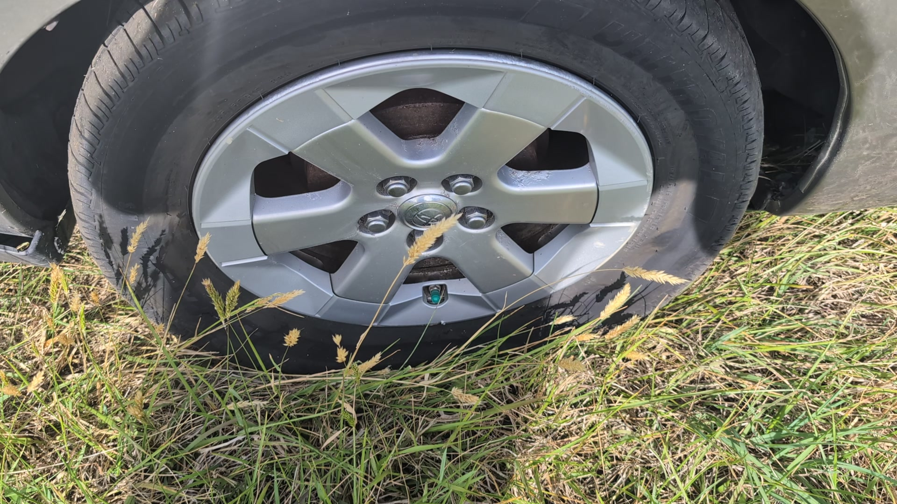
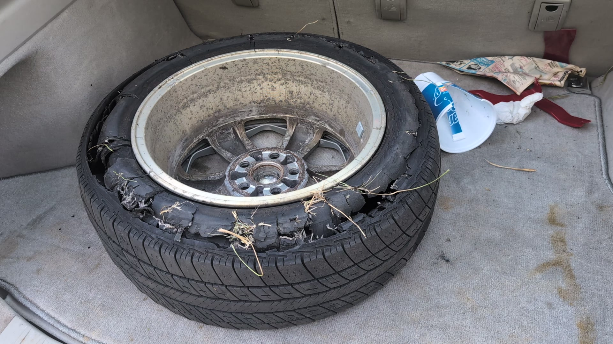

## I blew my first tire today.

I felt some shame with this rite of passage. My car started shaking a bit as I passed some road debris -- a burst tire freshly shed from a downstream semi; a drowning maniac taking down another with it. 

I gently guided my sickly machine to the shoulder. I have imagined this scenario many times, wondering how well my car would handle - and how well *I* in turn would handle it. In this case I could feel the tire squelching around as I slowed, but traffic was kind to me and I got off the road easily. A flat grassland adjoined the shoulder, affording me greater distance from the highway. 

I took a deep breath, assuring myself that I could probably figure this out. I haven't ever replaced a tire before. In fact I can't even remember watching someone replace a tire! But I dismissed the thought saying *you may not be able to do this* as unhelpful, and got to work pulling the spare tire out of my trunk. I found the jack - *oh yes, I'll need that!* - and began to root around for a socket wrench. In that moment, I truly had no idea where it was, if I even had one. 

I had been pulled over for perhaps three minutes when I suddenly realized a truck with flashing lights had pulled up behind me. The words **NCDOT INCIDENT MANAGEMENT** accompanied a familiar, friendly, anthropomorphic gecko. *Oh great, I'm getting a ticket. Well at least I'll get some help.* A man pops out with a smile and offers a greeting.

It would be completely feasible to me that Larry were an angel - but I don't think angels are the sort to leave me a card so I can write him a review. He inflated my spare tire (though was impressed that I carry my own inflator). As he jacked up my tiny Prius and pulled out a powerful impact wrench, I looked down at my sad little tools. An small but undeniable (and masochistic?) part of me lamented that these tools would remain unused; that I still have not replaced a tire. 

The feeling passed as Larry finished in five minutes what would have most assuredly taken me the better part of an hour and grinned at me. 

I offered him a lollipop. He declines and hands me his card. *No ticket!!* I shake his manly hand.

He reminds me that I should drive no more than fifty mph, and no more than fifty miles, and that of course there are good tire shops in my direction. To set my hazards, and that no officers will pull me over for impeding traffic. He has clearly helped people in my place an uncountable number of times.

I once nagged my father for not teaching me much about how to fix a car. I meant only to tease a bit, I didn't really mind. With a smirk, he replied that he had *'taught me how to make enough money to pay someone to do that.'* 

Well Dad, as my new pamphlet says, '*IMAP service is free of charge and patrol drivers are not allowed to accept tips.'*

So that's why he didn't take my lollipop.

