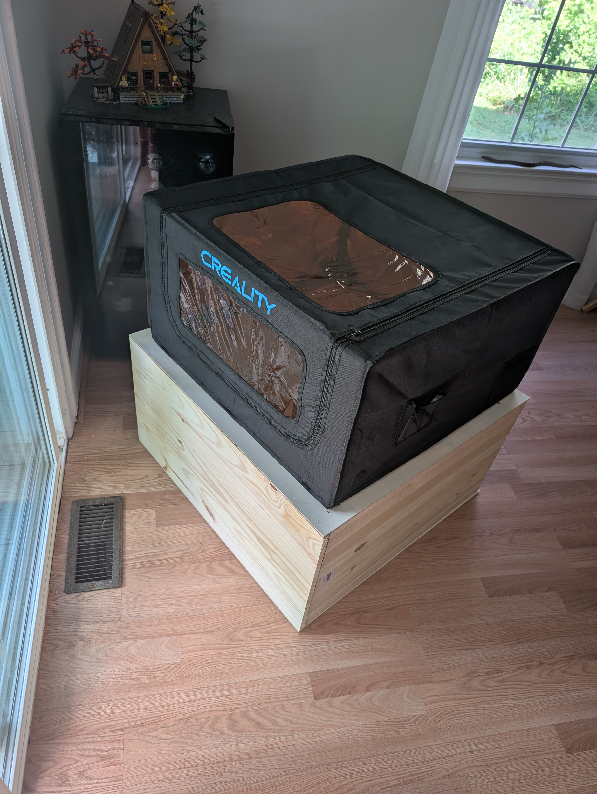
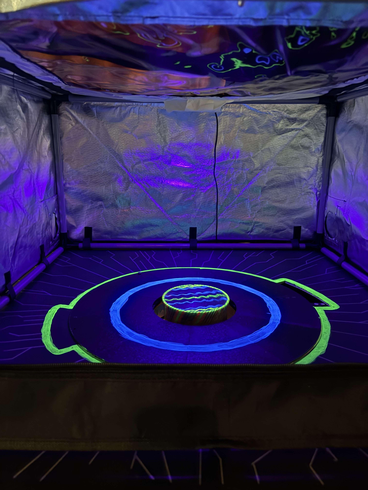
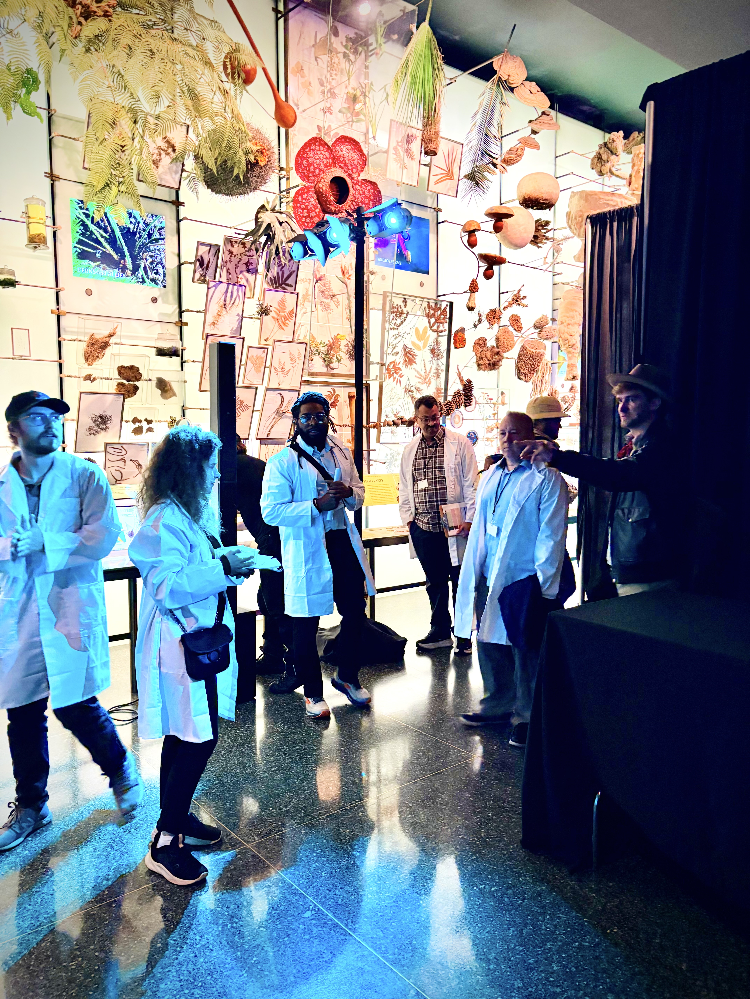
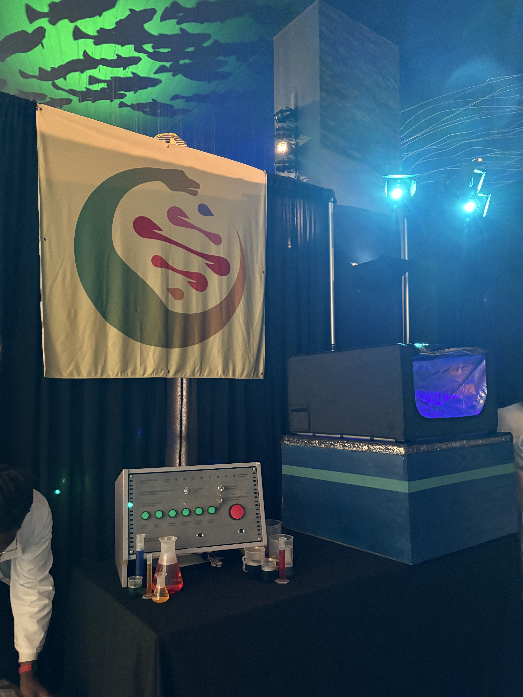
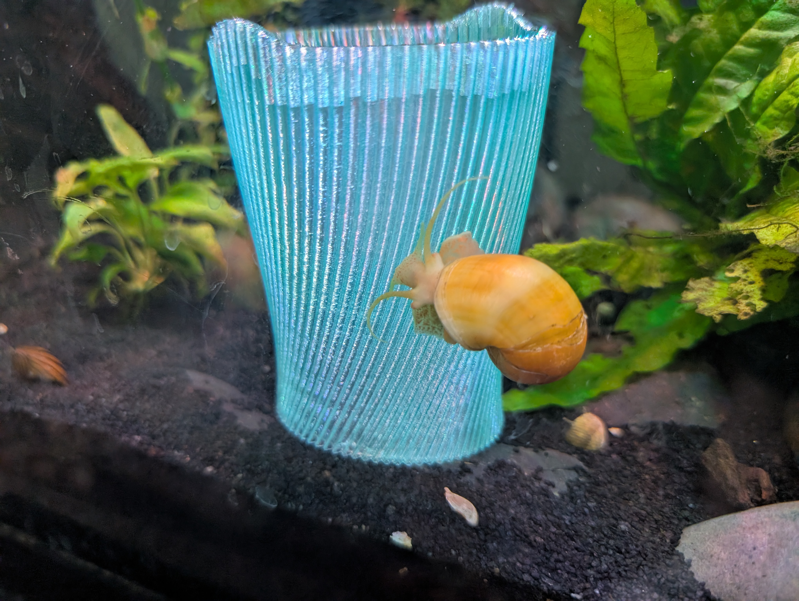

## Problem
Gotham Immersive Labs contracted me to build them an "appearance cabinet." A box should appear empty, a thing should happen, and then a stuffed animal should suddenly appear. This was for a summer party for a financial institution, who rented out the freakin' Natural History Museum!
## Process
This was a real project, with a tough less-than two month turnaround! After thinking about the problem for a while, I decided that instead of the device seeming fully magical, it should feel like a scientific instrument that generates the dino inside. I came up with the idea of having the dino be encased in an artificial egg, which rises out of a gap in the floor of the machine as it is cranked open by the players.

I used a laser cutter enclosure as the top bit, and built a wooden frame for the base.

I first worked on developing an 'iris mechanism' that would open up and let the egg through. I modeled and printed three different models I found online before settling on one that I could (dramatically) adapt for my needs. This thing was huge though, and took many, many prints that needed to be glued and assembled. Getting this thing to work consistently and with low force was a fun challenge!

I love how you can see just a bit of the blue leaves moving under the black faces!

I decided that the stuffed animal should be encased in an 'artificial egg' to keep it sturdy while in motion... but I also thought it would really add to the experience. I designed and printed the egg in translucent PETG, using shark eggs as inspiration. I really adore how the internal pattern comes out to look like veins. I used little pins to lock each half in place, after tuning their grip very closely. 

I wanted the egg to rotate as it rose through the floor, so I engineered this tower assembly. The egg does three full rotations as it ascends! UV paint and light also adds greatly to the mystery of the contraption!

(I need to add a good video here!)

On the exterior of the contraption, the players got to pull a handle to open the iris, and then spin a crank I pulled off a meat grinder to spin a huge gear with the logo of the fictitious company printed onto it. Check out Elijah giving it a test!

A huge thanks to Elijah and Sarah for giving me a hand at the last minute! 

## Result
Elijah and I helped run our machine during the actual event! Check out how cool it was to be set up in the Natural History Museum!!

Though I intended for the crank to directly move the egg, we ended up having Elijah "puppet" the contraption from behind to prevent damage. I added a tube with balls and bits inside to make the user really feel like they were doing something interesting on the inside, and nearly no-one realized they weren't directly driving the machine!

Also enjoy this cute pic of my snail enjoying a test print of the egg:
