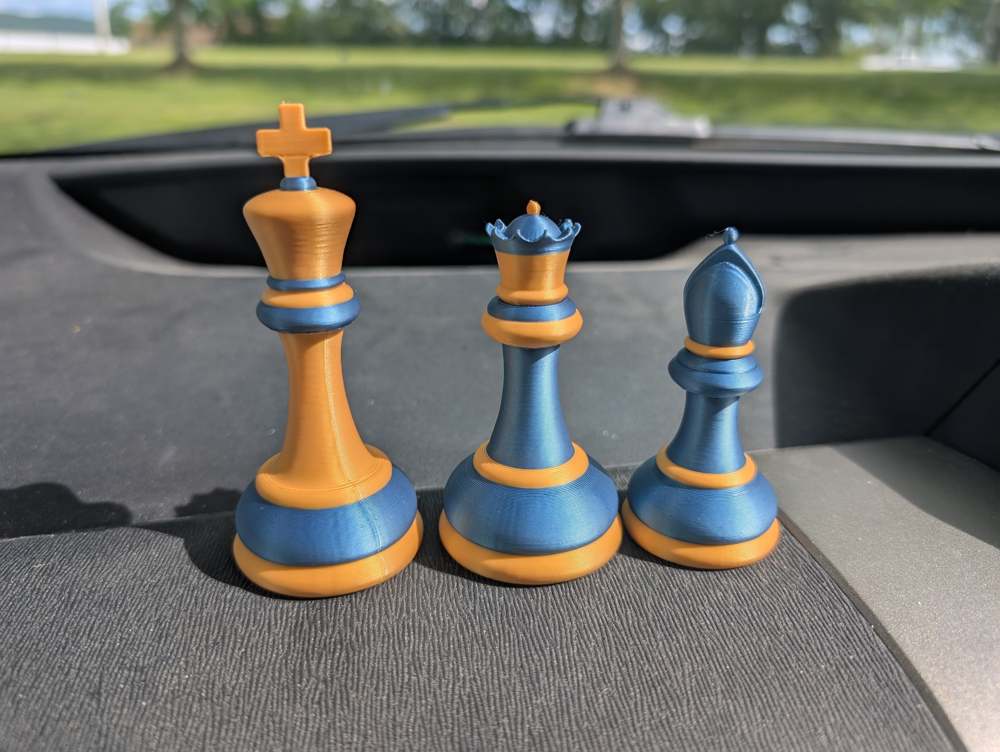
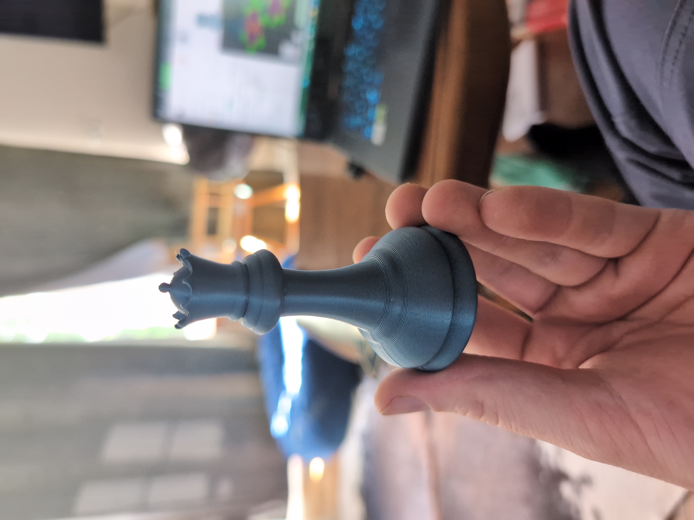
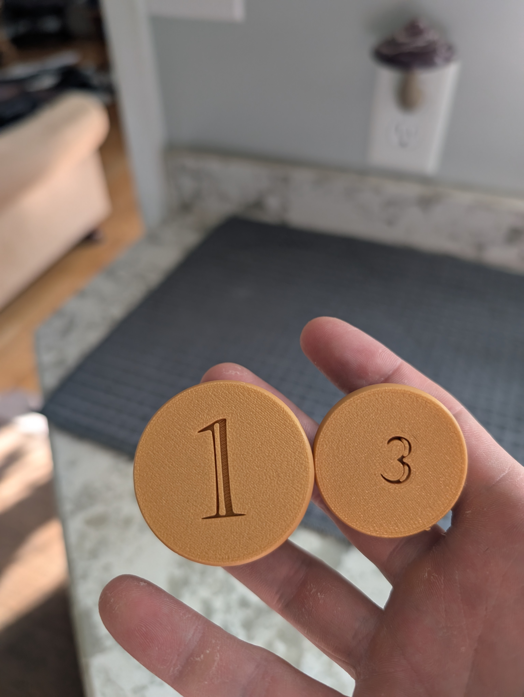
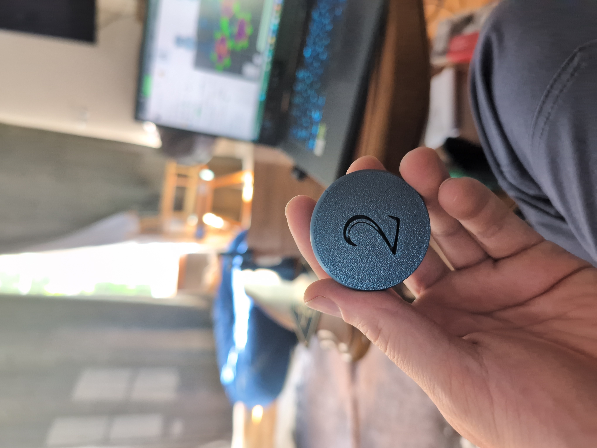
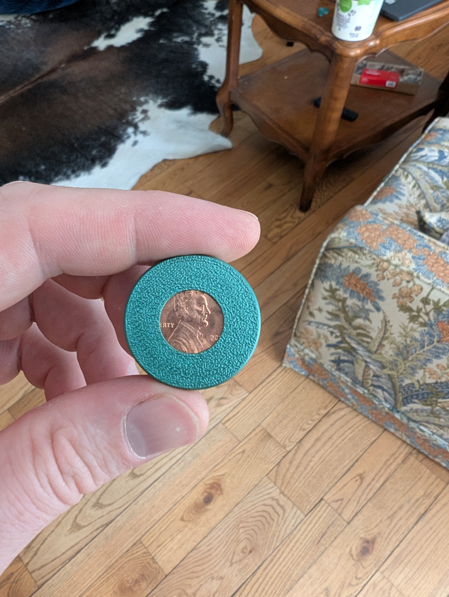
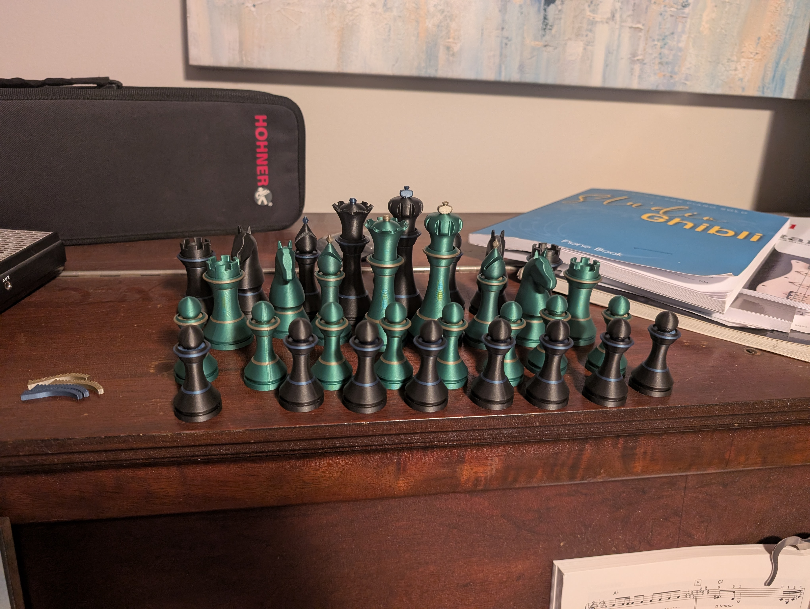
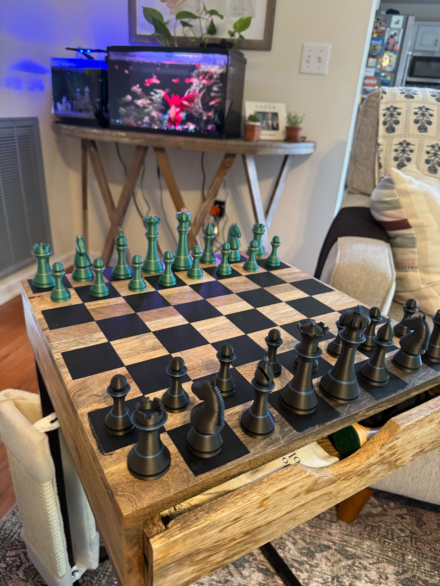

## Problem
1) Make chess pieces as trophies for middle school chess tournament.
2) Make a functional, beautiful chess set for a friend

## Process
A middle school teacher friend of mine asked if I could print him some trophy pieces for a chess competition he sponsored at his school, which I happily obliged!

After seeing these beautiful pieces, another friend asked if I would make him a whole set! I wanted to make the pieces just as beautiful, but also add a satisfying tactile weight to the pieces. To accomplish this, I nested coins inside the bases.

## Result

Pennies in the pawns, nickels in the rooks, knights, and bishops, and quarters in the kings and queens! The set turned out gorgeous, with fantastic variable layer height. I learned a lot from this project!
