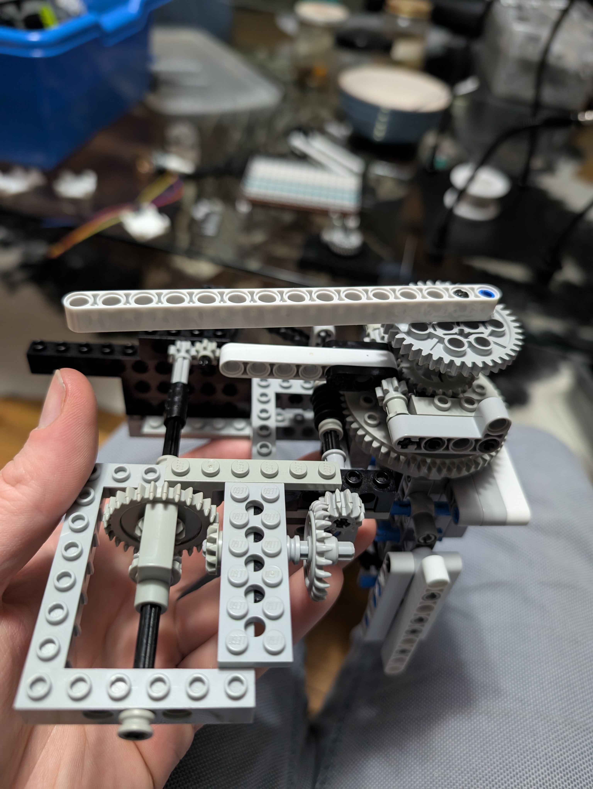
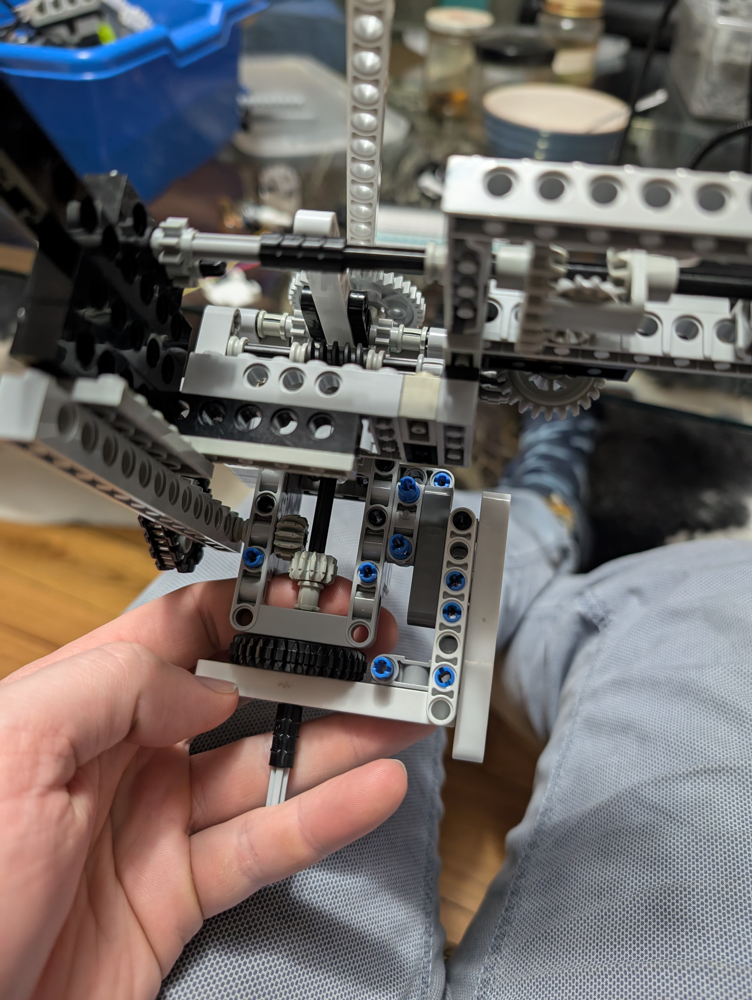
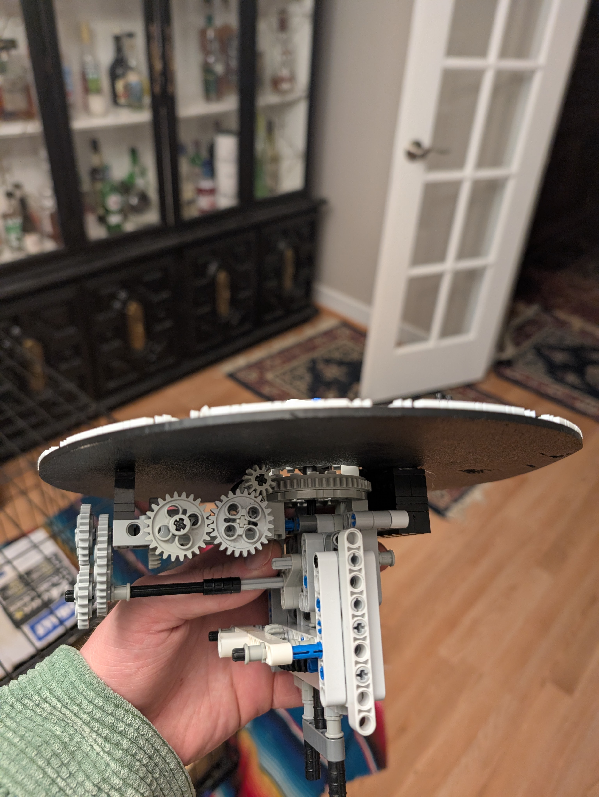
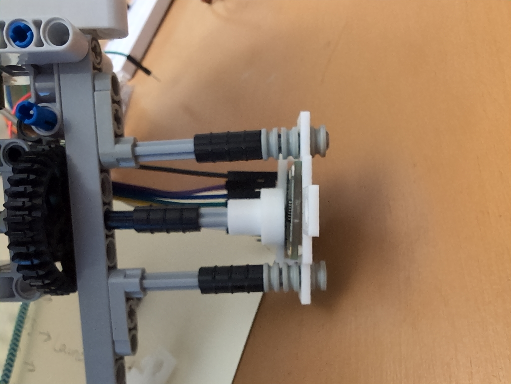
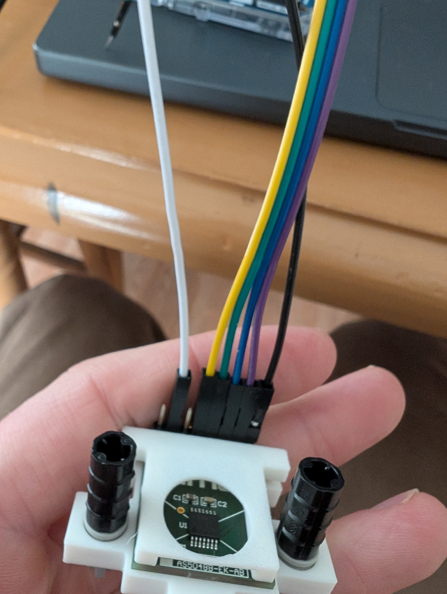
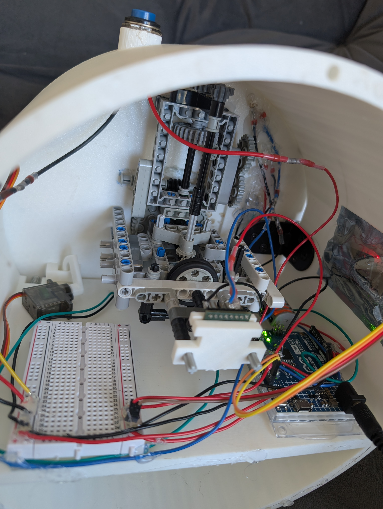
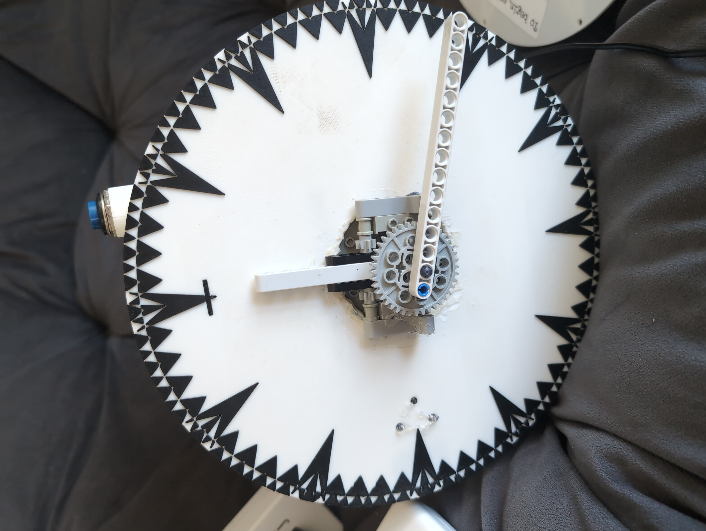

## Problem
Make a physical clock that the user puts times into to solve a puzzle.

## Process
The idea here was to make a combination lock that looks like a clock, so that puzzle answers need to be input to solve this meta puzzle. And then the clock will open up!

I built the gearbox entirely out of LEGO Technic, and printed adapters to interface with mechanical sensors. A polarized magnet was attached to the moving shaft, and a magnetometer precisely read its orientation to get the time.

A few of the inputs required the device to know the actual time and date, so a timing unit was also implemented.

## Result

I ended up not putting this out for the Hunt, as I knew people would simply break it. However it was fully functional, and many people got to play with and enjoy it!
