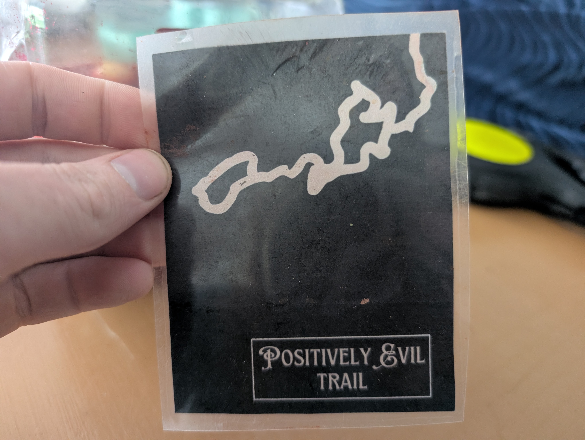
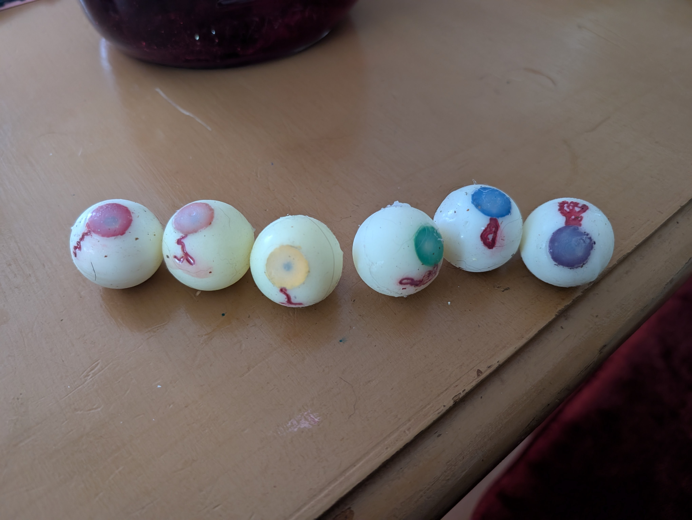
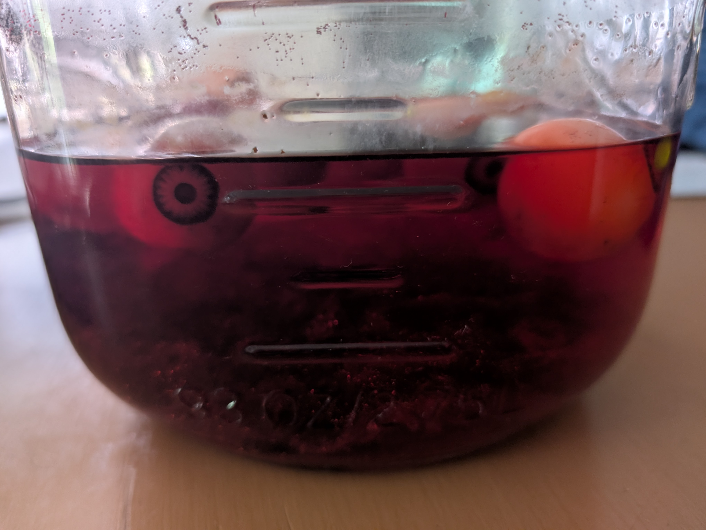

## Problem
A member of the VT Hunt team designed a creepy puzzle that required eyes with specific vein patterns!
## Process
Having some experience with using silicone for a soft robotics project in college, I knew it would make some disturbingly realistic eyeballs. I modeled and printed some eye models, as well as a separate piece for the clear lens and used them to cast molds with the aid of a small vacuum chamber I found online.
For the puzzle mechanic to work, veins also had to be modeled readably, which was a fun challenge.

For each of the six eyes, I had to print a piece, cast a mold of the eye, paint the eye, also cast and make a clear lens piece, and dry it all together with more silicone. 

Plopped them in a jar of water colored red for the solvers to have to reach in and get for an added layer of disgust! 

## Result
I couldn't be happier with these eyeballs. The puzzle functioned quite well, and the eyes are so fun to play with. They feel like bouncy balls! 

A playable version is available at the VT Hunt website [here](https://vthunt.com/past-hunts/haunt-2024/eyes)!