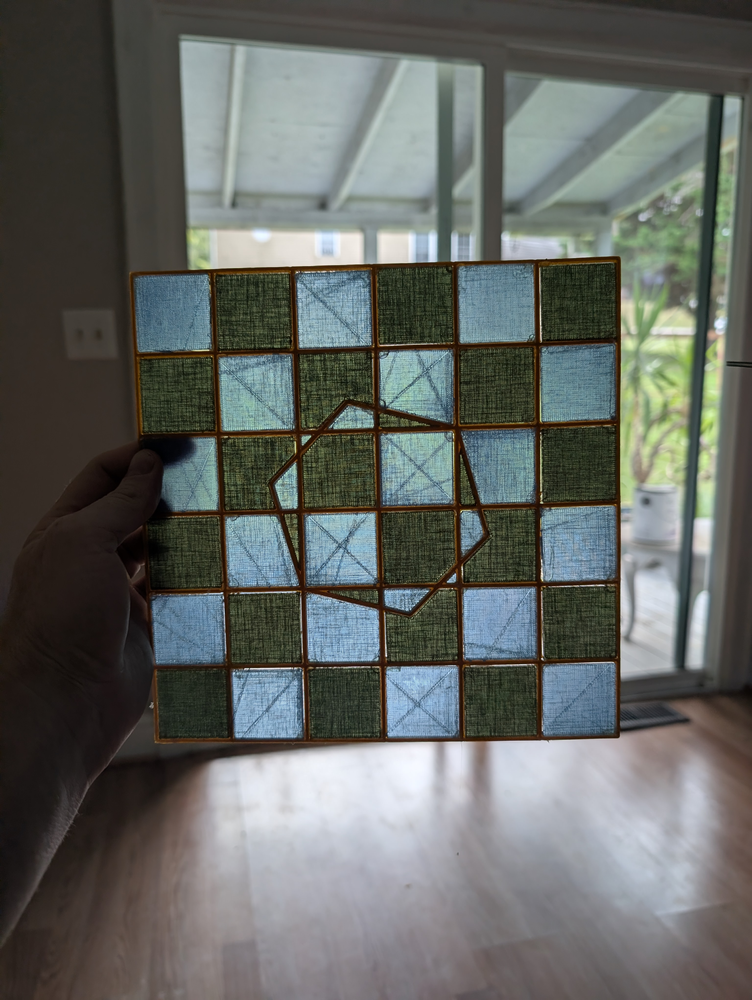

## Problem
Bathroom light is too bright... and not nearly whimsical enough!
## Process
I've really loved playing with translucent PETG in the past. I've made gorgeous lamps and cool vases, but it's a tricky material to get really translucent! I thought it would be fun to experiment with using that material to make the light feel more like a stained glass skylight.

I began by drafting out a geometric design featuring a checkerboard shape with a septagon in the center. What an underrated polygon. I then added a shell cage that would act like the solder in a stained glass piece.

Getting a 3d printed material to be transparent is very tricky! If you're going to try it, I found best results by cranking up the heat, slowing the nozzle way down, turning off the fan, and -most importantly- keeping 100% infill. That sucker has to be *solid*. Any air in there makes the piece foggy.

I ended up getting these random lines in my first batch job, from the toolhead dripping extra material as it slowly traversed to its next piece. I fixed that for the second (green) batch by increasing the travel speed in between extrusions. I think it adds to the stained glass effect though, so I didn't reprint the blues. I hot glued the pieces right into the frame!

## Result
After using more hot glue to fix the sheet to my fan light, I think the effect works quite well! I wish it cast colored light around the room more, but it still looks lovely and is pleasantly eye catching. My house is a little less normal, hooray!

