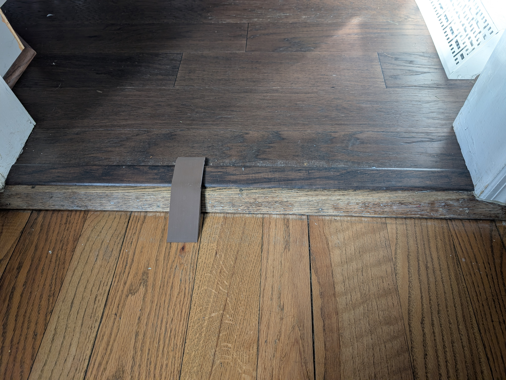
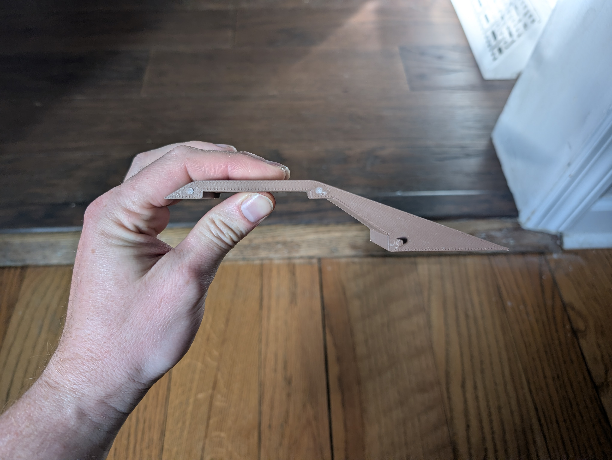
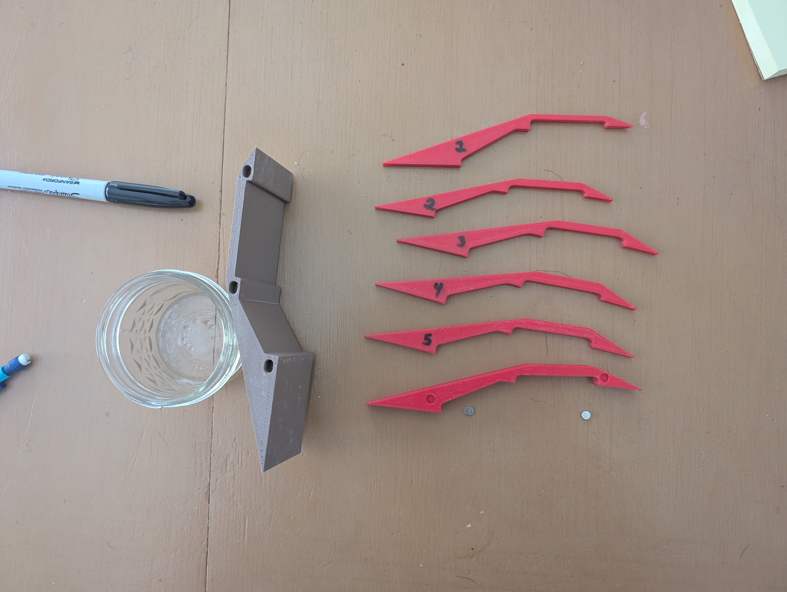
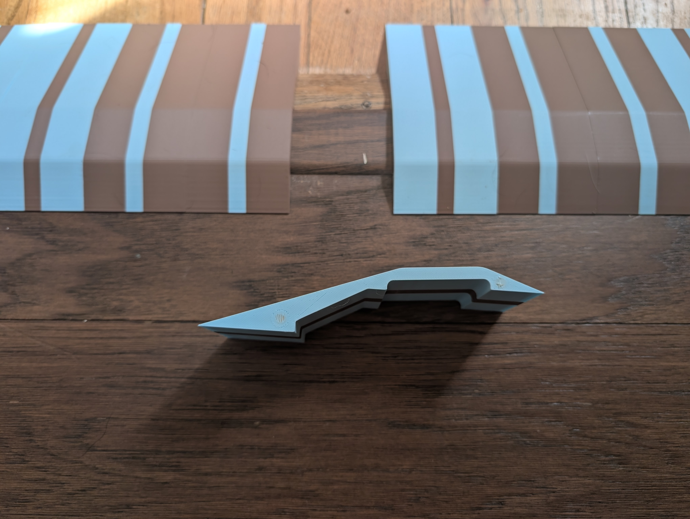
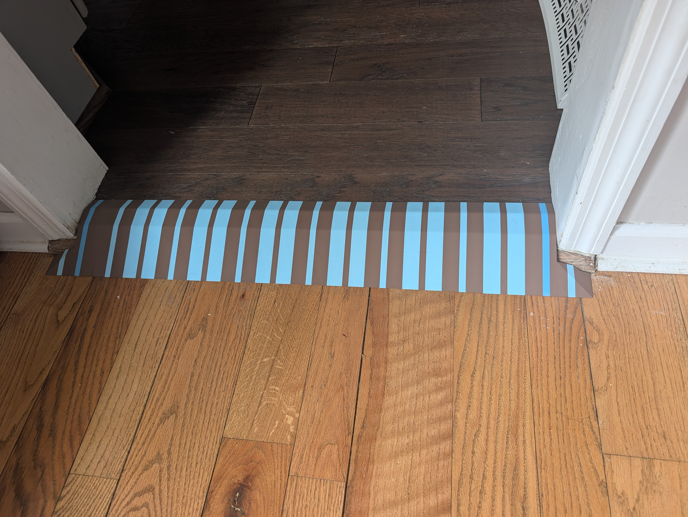
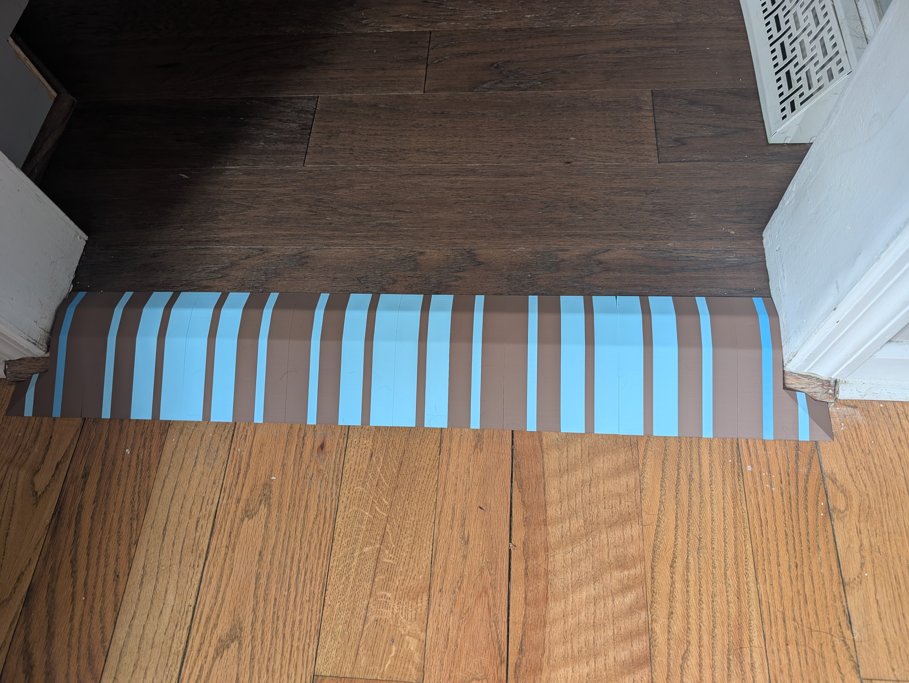

## Problem
The autonomous vacuum sometimes gets stuck between two rooms due to a small lip.

## Process
Over two years ago, I took this on as one of my first projects for my new printer. I tried to get a 3d scan of the lip using my phone, but the free apps I found to do this couldn't handle this surface instead of a free-standing object. I measured it myself and printed out these ramps, with dowels and slots to account for the slightly uneven surface.

These ramps lasted for about a year until someone stepped on them just right and snapped a piece, as well as the fragile dowels. This cascaded until stepping on it at all would knock pieces out of place.

I had a few ideas on how to make it much better! Firstly the ramps sit much more flush, reducing stress when stepped on. They also have magnets hidden in them to keep them touching without introducing fragile stress points (placed inside during the printing process!!). I added corner pieces to keep the vacuum from hitting sharp edges. Here are some drafts I printed to get the contour just right:

My favorite little touch was dipping a few pieces in very hot water before pressing them in place, to have them mold a little better to asymmetries in the flooring!

I couldn't resist putting in a little pattern. Now the pieces can be arranged to form different designs!

## Result
The ramp has functioned perfectly so far!
Someone asked if it's a bar-code... I'll have to keep that in mind if I ever make another!
