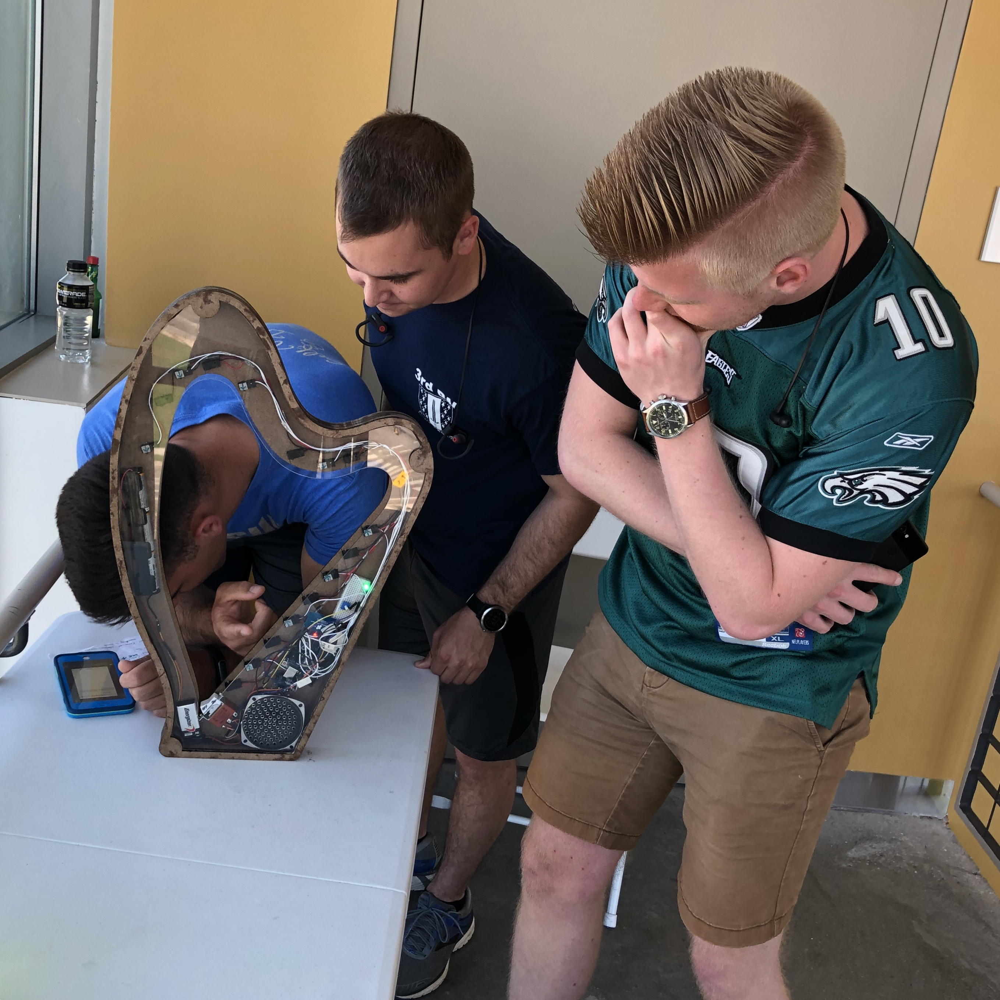
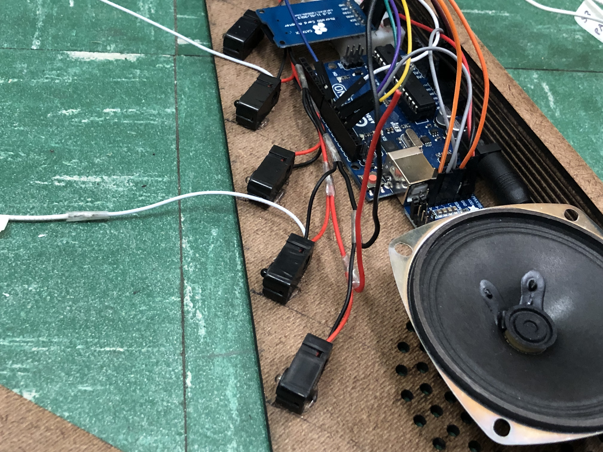
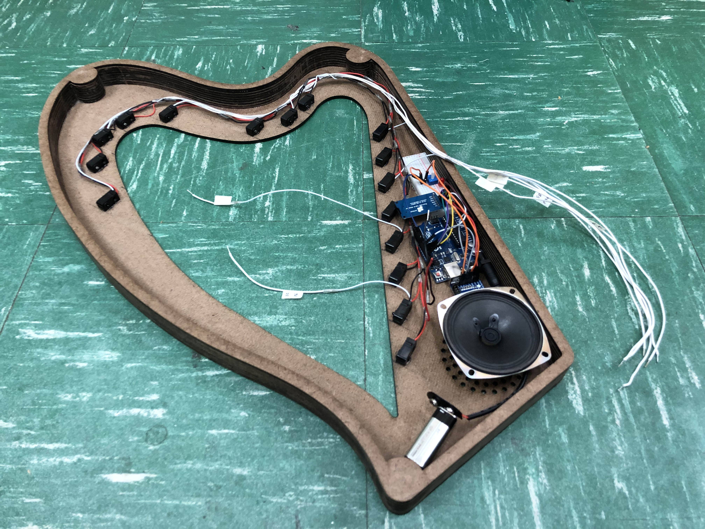
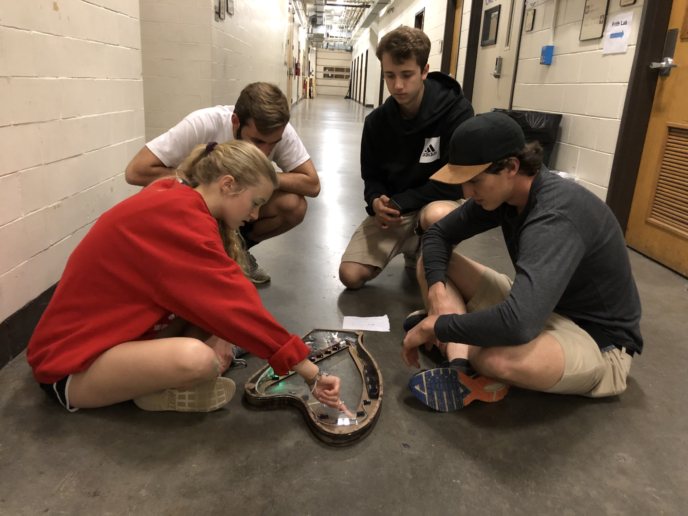

## Problem
Create a harp that has no strings! The user must play a sequence of notes correctly, and then be played their next puzzle prompt.

## Process
As part of my mechatronics project, I built this alongside the "Piano Puzzle" for the VT Hunt (as a secret!). I led a team of three other engineers who swore themselves into secrecy with me.

I settled on break-beam sensors as the strings fairly early, and designed the harp around this idea. Think of the sensor that you love to jump over while the garage door is closing.

Once the user plays the right sequence, a solfège audio puzzle is played!

The housing was milled from a few sheets of fiber board, and covered with an acrylic sheet.

## Result
After having to rescue the puzzle from the Frith lab runner and relocating the puzzle, as well as rewiring the thing to run on outlet power instead of devouring batteries, this thing ran like a dream!
If given just one more day to improve the design, I would have added hollow cylinders (maybe just straws!) to the emitters to narrow the paths.
