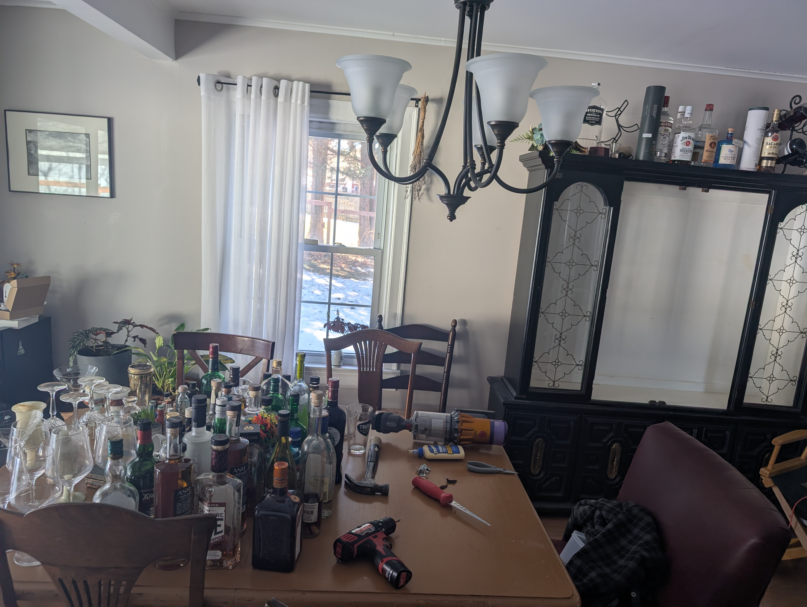
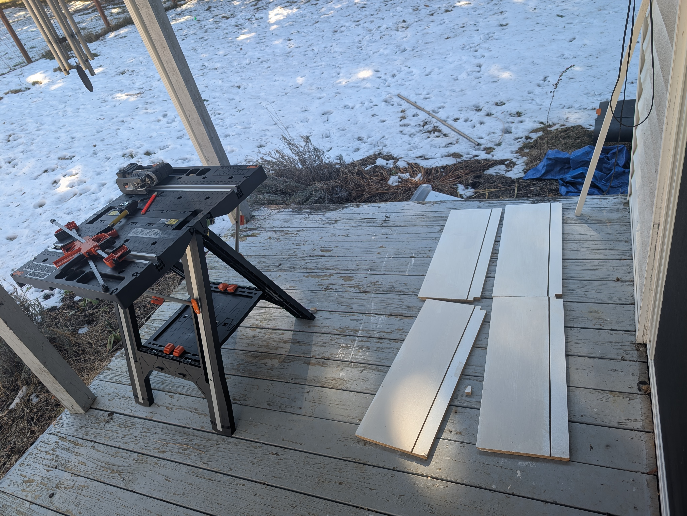
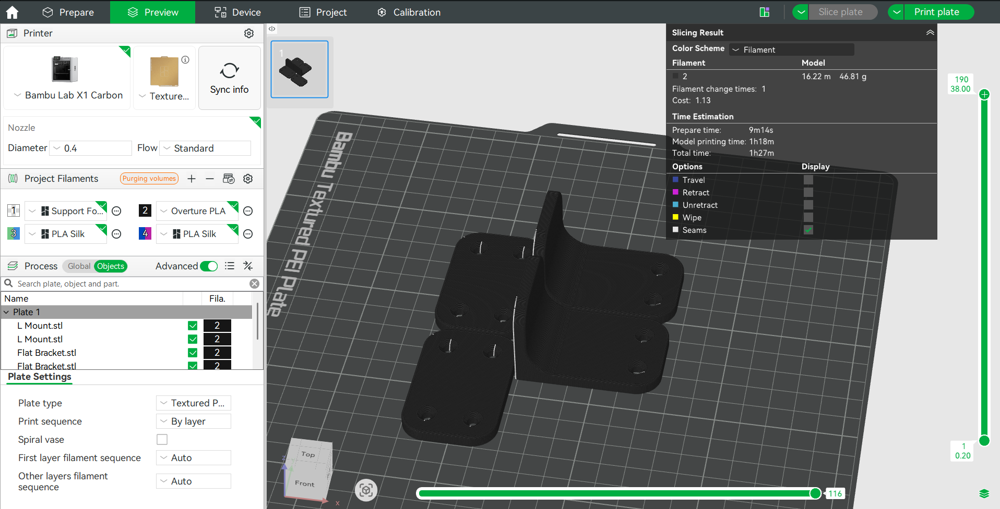
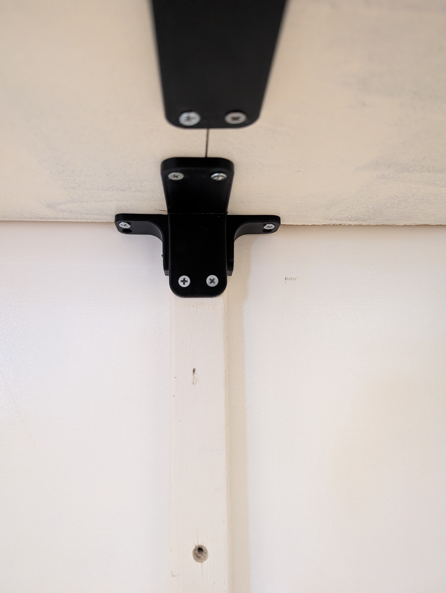
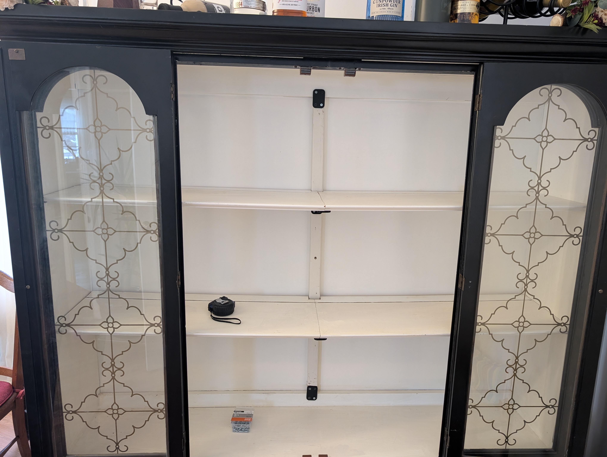
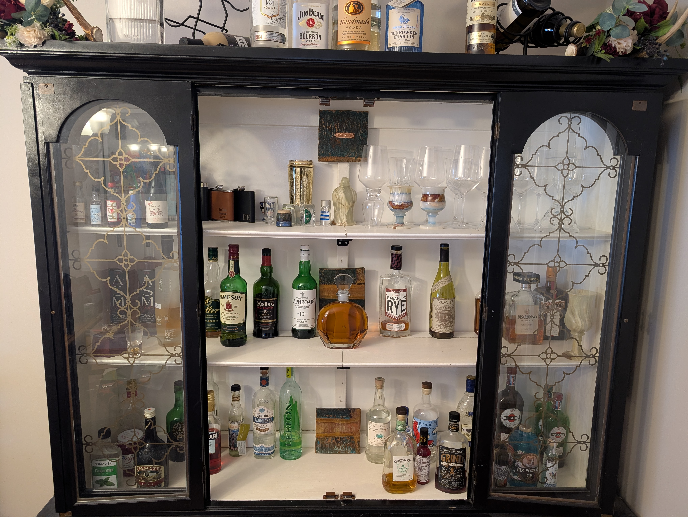

## Problem
The shelves in the liquor cabinet bow in the middle, and may possibly collapse!

## Process
Let's knock another task off the HoneyDo list and fix up the liquor cabinet! 
If I find a picture of how the shelves looked before, I'll add it here.
The shelves noticeably bowed in the middle, because they're only supported from the left and right edges. The back of the cabinet feels like thin plywood, so we can't trust that for support.
I grabbed some scrap wood from the garage, my handy jigsaw, some incredibly old paint from the basement from the previous owner, and got to work!

Frustratingly, the cabinet was not designed so that the shelves could be removed without having to disassemble the whole darn thing! So I just cut them in half right where they were and pulled them out. 

I got the shelves cut up and repainted them with the extremely expired paint, pulling usable goop out of the bottom. I hope that doesn't come back to bite me.

Being able to whip up some brackets out of thin air using my printer felt like actual magic. I love this thing. 

Designed and installed three different types of brackets to make the shelf sturdy.

## Result
Final test was to restock the cabinet, and the shelves feel nice and sturdy!
I love the painted copper art Julia brought back from New Zealand as well.
