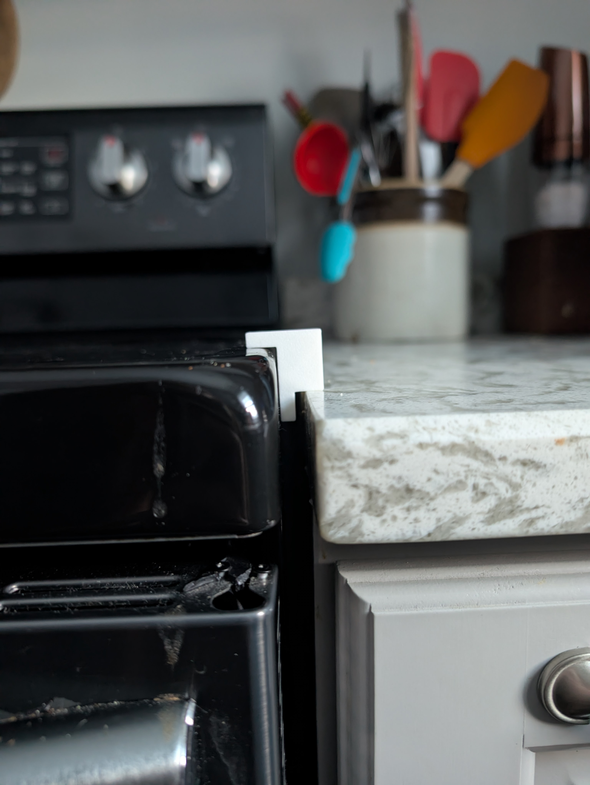
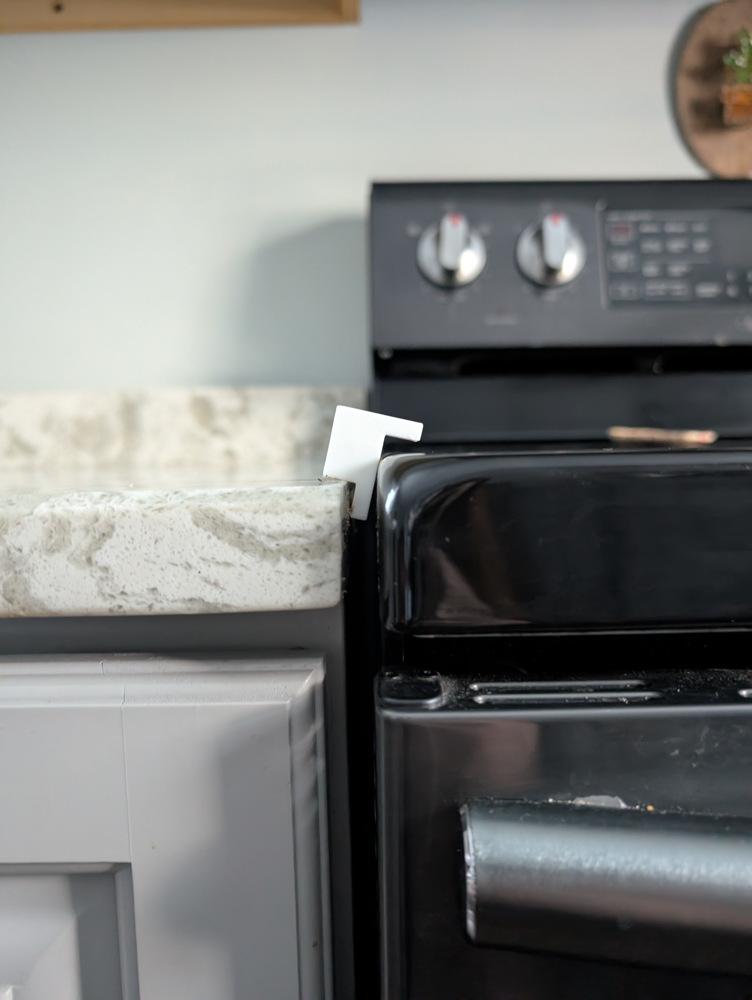
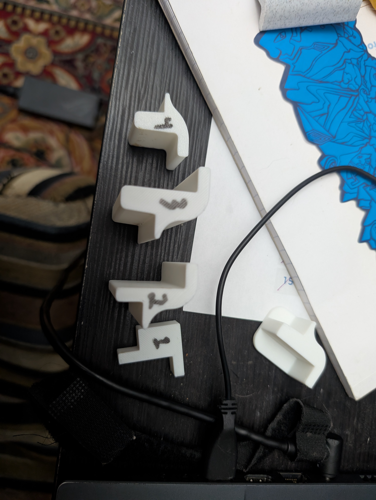
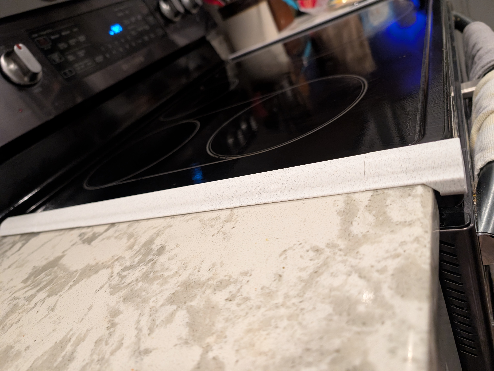
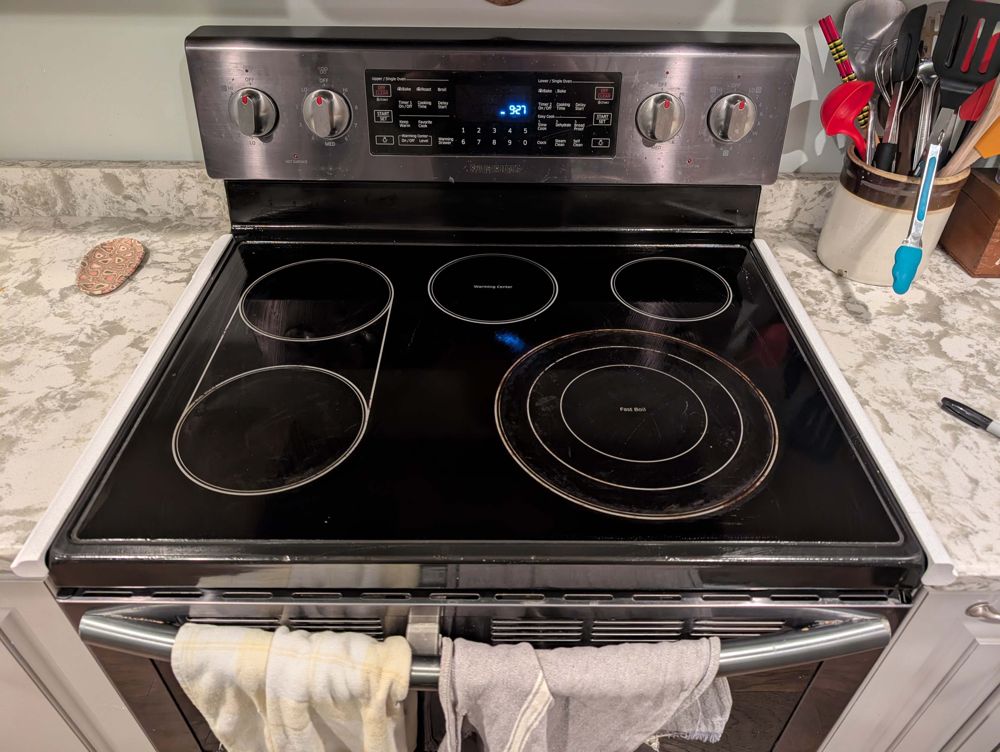

## Problem
Food bits fall between the cracks on each side of the oven and are very difficult to remove.

## Process
Plan is to print spacers to fit in the cracks - they need to handle warmth from the oven.

The counter is at a different height on the left side, so I needed slightly different parts. V1 worked well on the right, so I tweaked it for the left.

V2 worked well, but Julia requested the pieces not slide left/right. V3 has a larger, tapered shim.

## Result

Rapid prototyping made this project a cinch! Printed with [marble PLA](https://us.store.bambulab.com/products/pla-marble) to look nice in the kitchen. Total length: 550mm (5x 100mm blocks + 50mm cap). Bagged it up as a birthday gift for Julia - will sticky tape it down after she opens it up in a few days!

She likes them! ...mostly.
She had the wonderful idea of putting magnets in them so they snap together (which I don't think is really necessary, but does sound fun!) And since I need to reprint them all anyway to do that, I might as well make them black and white and have them say something in morse...