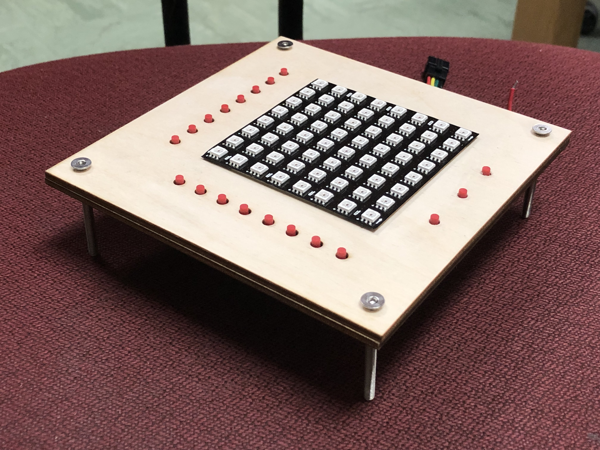
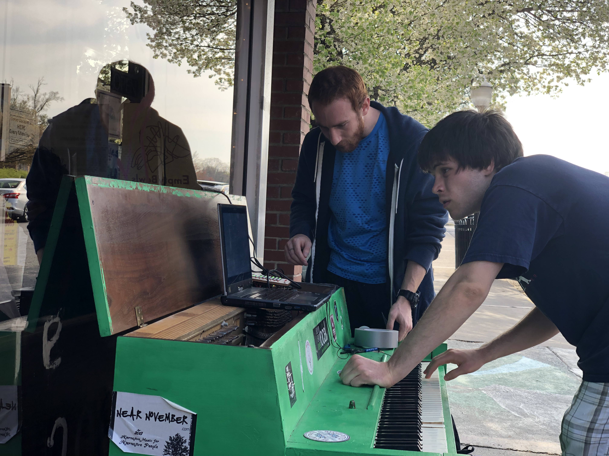

## Problem
Hide a logic puzzle in a public piano!

## Process
As part of my mechatronics project, I built this alongside the "Laser Harp" for the VT Hunt (as a secret!). I led a team of three other engineers who swore themselves into secrecy with me.

This puzzle was hidden in a public piano just off campus.

This device had two major functions: "listen" for the right sequence of notes on the piano, then unlock the logic puzzle. Instead of actually doing very difficult audio processing tones, I simply placed switches on the back ends of the keys out of view. Once the user played the phrase "DECAF" (seemed fitting, outside the coffee shop!), the bot would switch to its next mode.

The user then needed to figure out how to make the specific shape given on the 8x8 LED display. No instructions were given, so the user was forced to play around and find out the functions. Three buttons at the bottom set different modes: toggle, on, and off. When a button by a row or column was pressed, that whole row or column would be set according to that rule!

## Result
The puzzle beguiled and interested hundreds of hunters, hooking them for the rest of the event.
Unfortunately, shortly after the event wrapped, a drunkard destroyed the piano and its contents. :(
