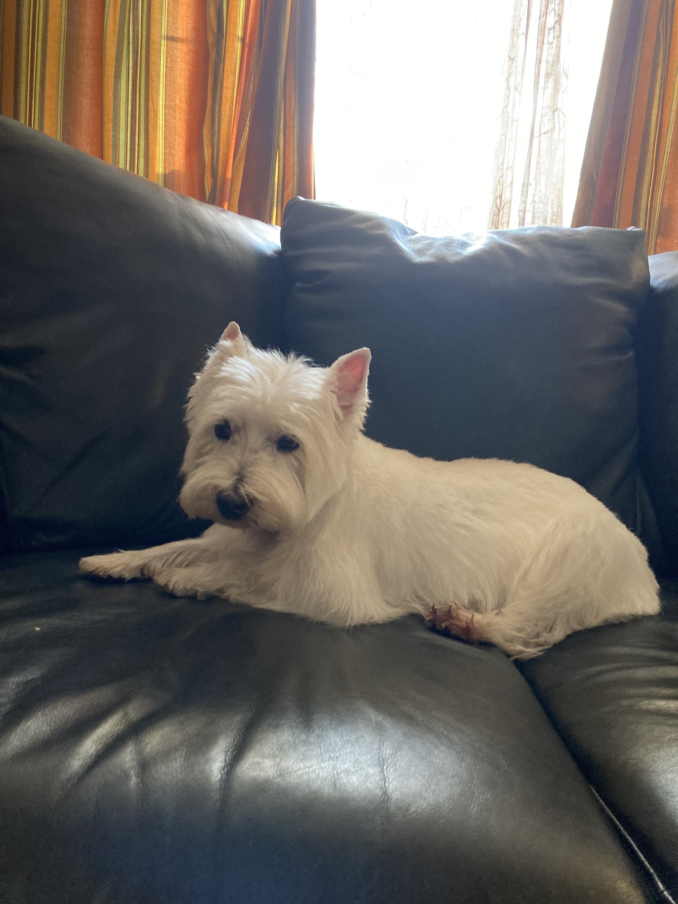
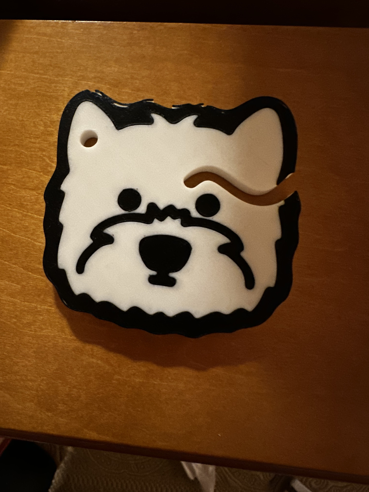
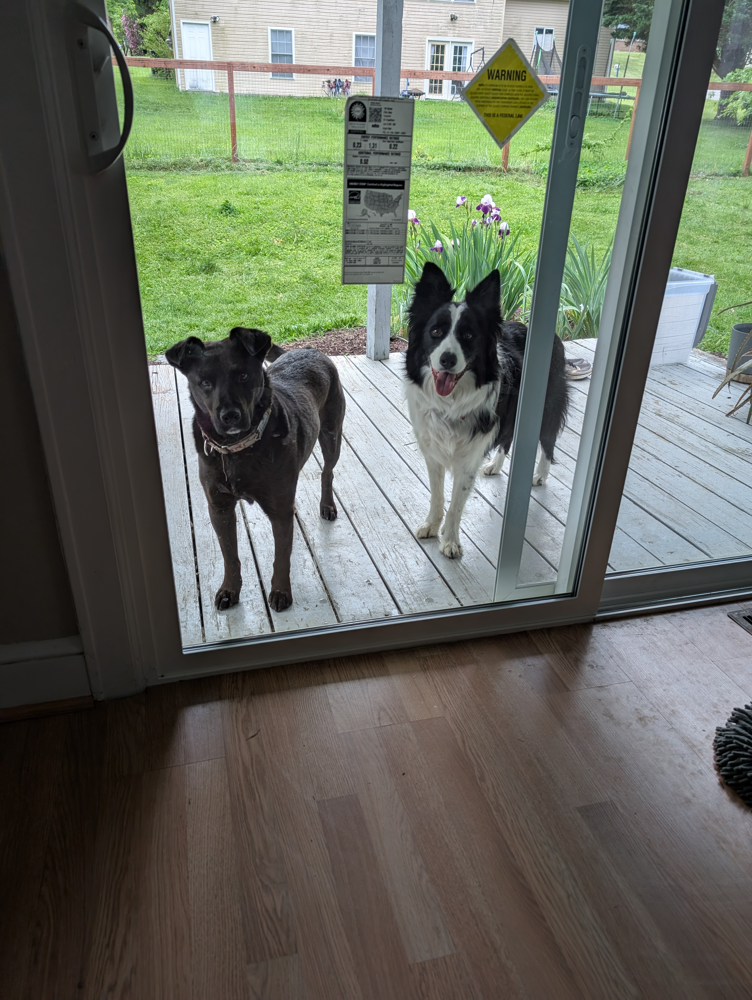
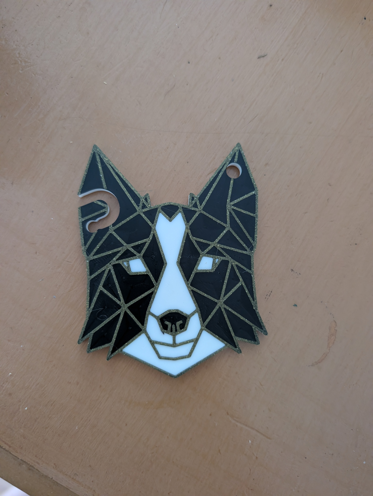

## Problem
I broke the old dog poop bag holder! Now I have to carry a stinky poop bag!
## Process
A while ago, I found a yorkie face model online and made my mom a poop bag to look like her dog, Blaise:

This time, I modeled Cypher's face after looking at a lot of line art of dog faces online. 
It was trickier than I thought it would be to make a good channel for the poop bag not to slip out of, so it took a few tries. I ended up testing with a bag I filled with some gravel.

In September 0f 2026, I decided to make a nice one of these for Megan's birthday, modeled after her dog Trev. I found a sketch online of a very geometrical husky, and changed it to look just like Trev:

I would love taking a commision to make some for you and your dog!

## Result
The final version holds that bag no problem! Cypher even had a record breaking three poop walk recently, which the holder handled with no drops. Hooray!

