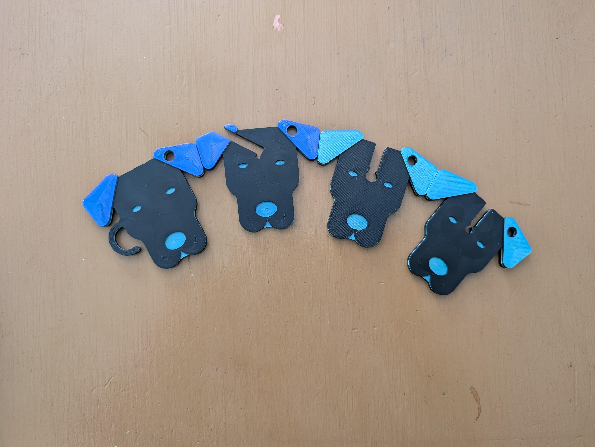
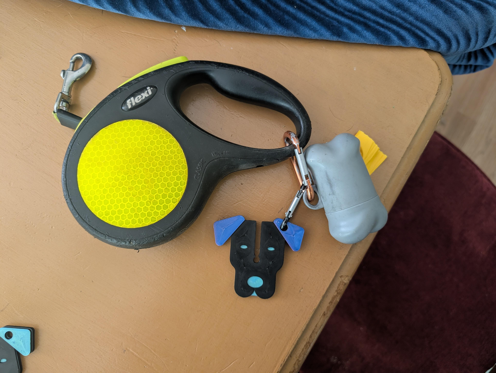

## Problem
I broke the old dog poop bag holder! Now I have to carry a stinky poop bag!
## Process
I modeled Cypher's face after looking at a lot of line art of dog faces online. 
It was trickier than I thought it would be to make a good channel for the poop bag not to slip out of, so it took a few tries. I ended up testing with a bag I filled with some gravel.

## Result
The final version holds that bag no problem! Cypher even had a record breaking three poop walk recently, which the holder handled with no drops. Hooray!

