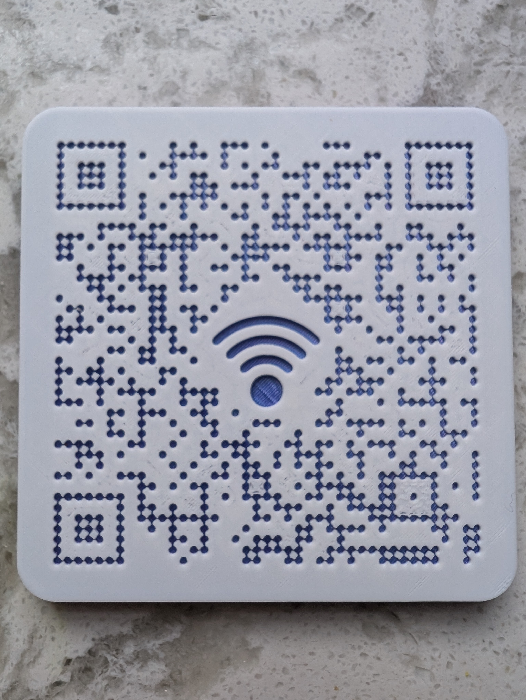
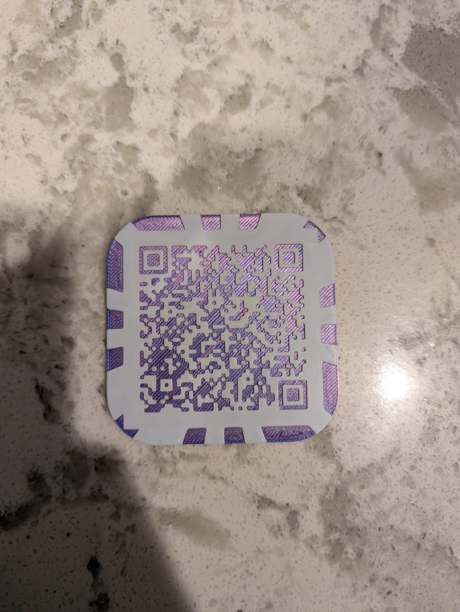

## Problem
Communicating our home wifi name and password is slow! People should just be able to hop on!

## Process
At a friend's house recently, I saw that they had printed (on paper) a qr code for the home wifi. I wanted to emulate that in beautiful, 3D form!

My original version above was pretty, but wouldn't scan very easily. I let go of the central image and made a thicker border.

## Result

She scans beautifully, and now lives on our fridge!
