## Problem
While I was almost completely uninvolved in the VT Hunt this year, I still helped test and hosted the team for the hellish week leading up to the event. One puzzle was in a rough way, and I had an idea to completely reimagine it. I wanted to:
Create a puzzle that requires the solver to create a cube that acts as a marble maze. Also, for stupid meta-puzzle reasons I could not control, the answer word must have been [REDACTED].

## Process
I planned for runes to be inscribed on each tunnel opening. These runes would correspond to a row and column on a scroll, which explained lore of the item as a Shakespearean sonnet (the VT Hunt theme was of a magic school).
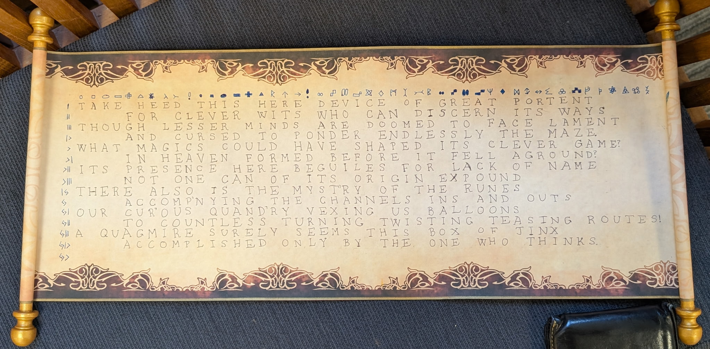

I mocked up what I wanted the cube to look like using LEGO. I considered what pieces would be fun to arrange and be the right challenge when assembling a cube, as well as what features would be fun to have in a marble course.
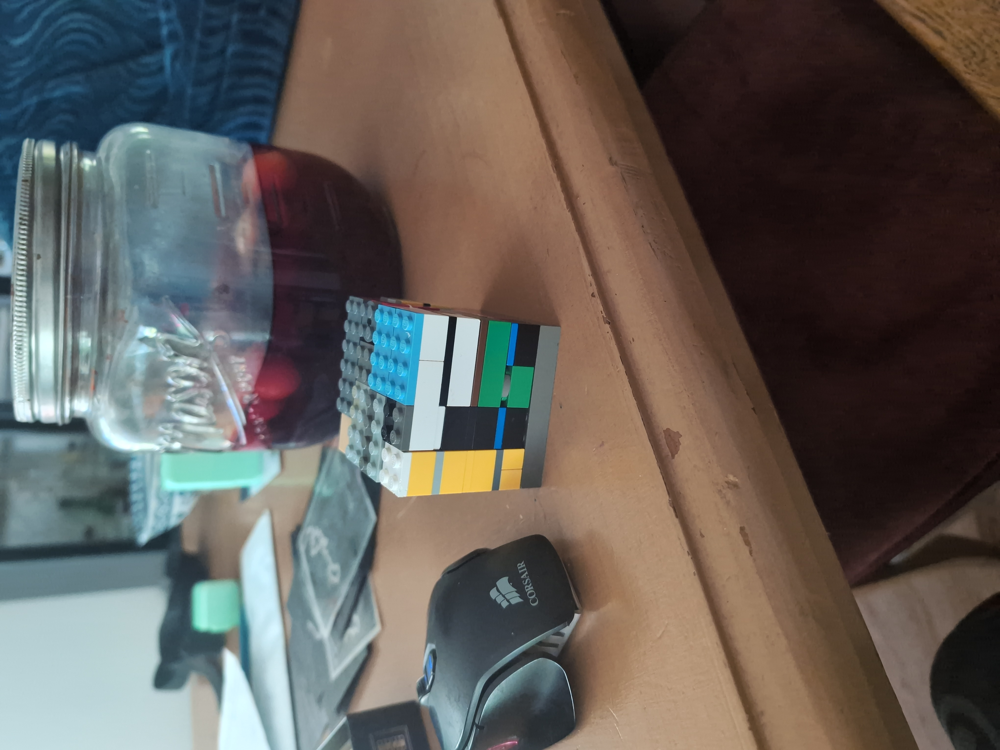

After making this LEGO mock, I chose the path for the marble run and drafted the pieces in Fusion360. I printed out a version much smaller than the original to test with; I was curious how difficult assembling the cube would be with holes that must be lined up. I wondered if adding false marble paths would be necessary... but I found through testing that assembling the cube was the right amount of difficult.

I then wrote out the poem, developed the symbols, and decided to add some fun ciphers. This trick would deter players from deducing which marble paths could be connected by knowing which letters could follow another. I decided on "CAESAR_13_NGONFU_JMUYVZEU". Performing a caesar shift cipher on the text right of the 13 would yield another cipher, "atbash." Performing an atbash cipher on the remaining text would finally reveal the answer... "disornis."

CAESAR_13_NGONFU_JMUYVZEU    ->
CAESAR_13_ATBASH_WZHLIMRH    ->
CAESAR_13_ATBASH_DISORNIS

Finally, I applied the runes to the pieces in Fusion360 and began to print.

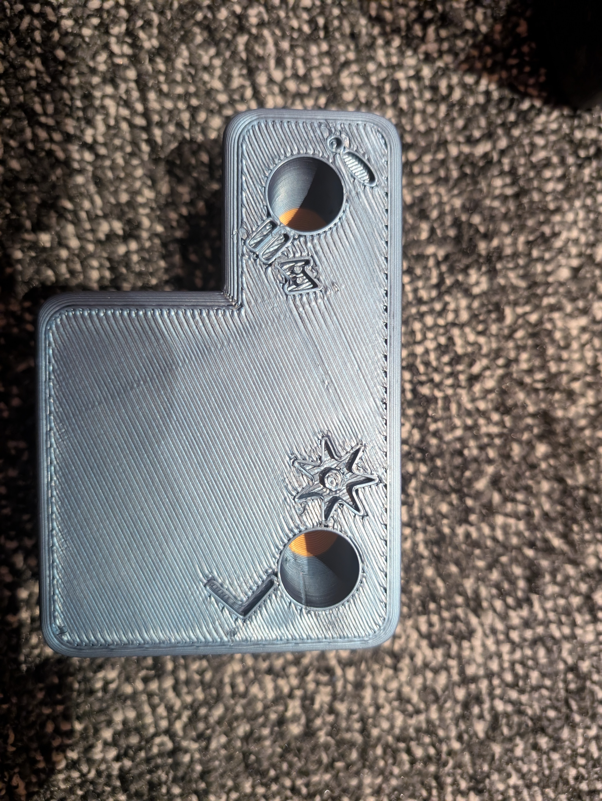
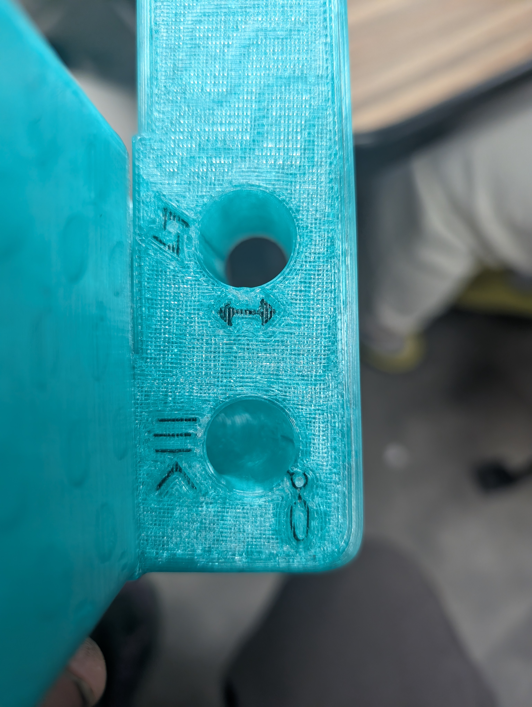

This purple rune is a little special. It is meant to notate the value 13 instead of a row and column!
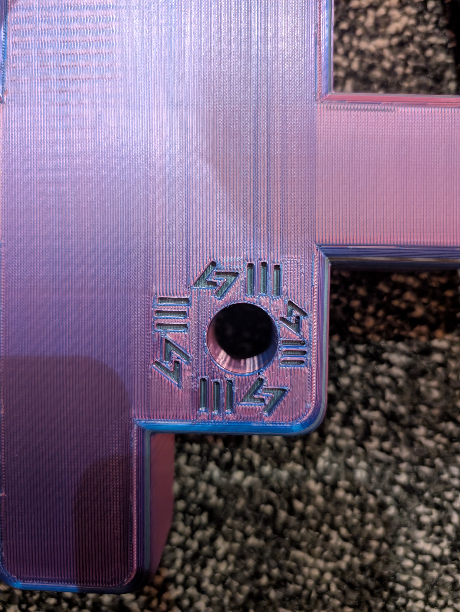

And finally, here is how the cube can be constructed!

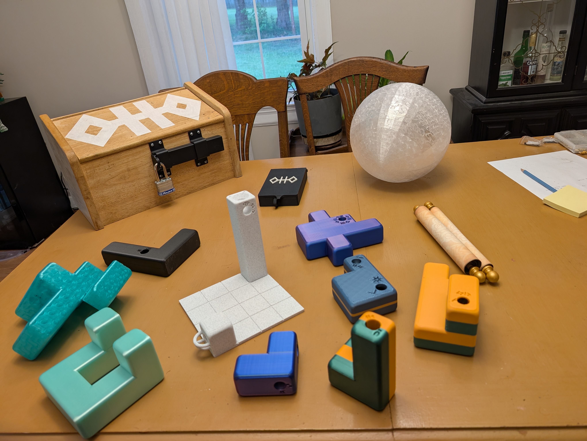
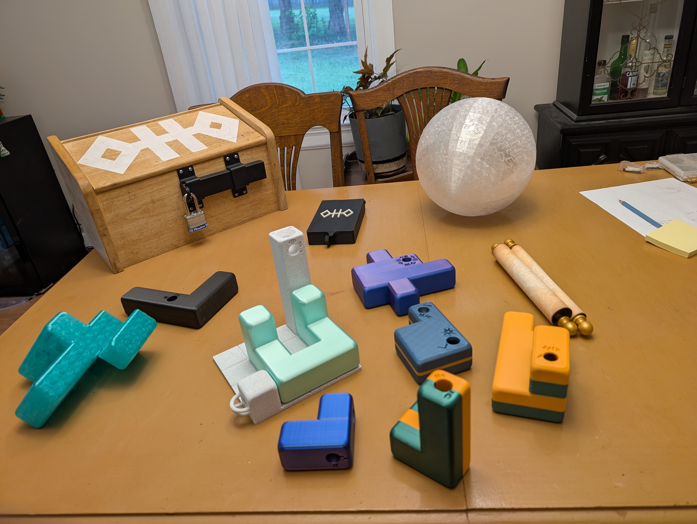
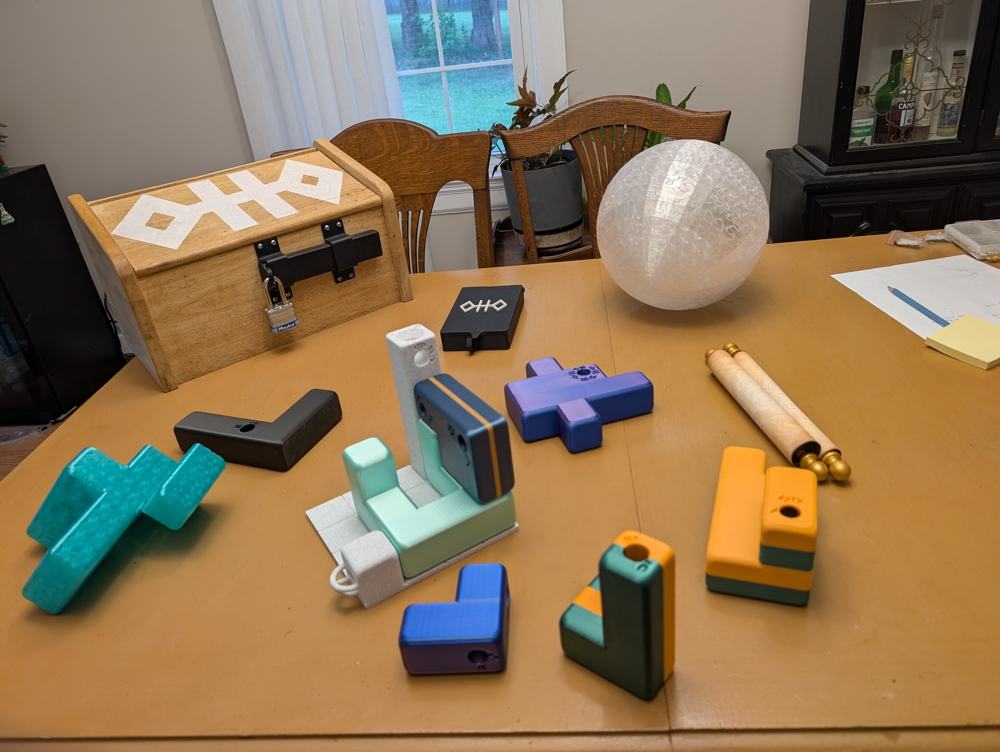
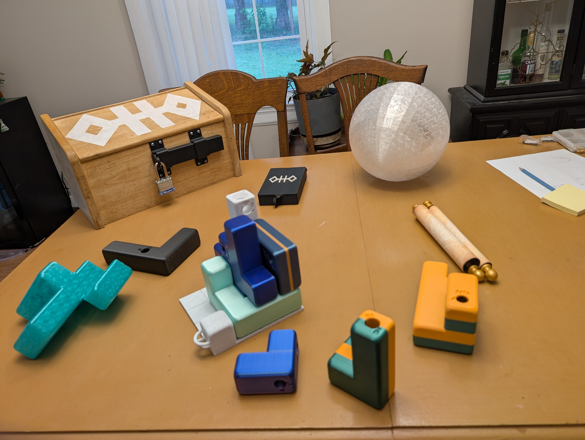
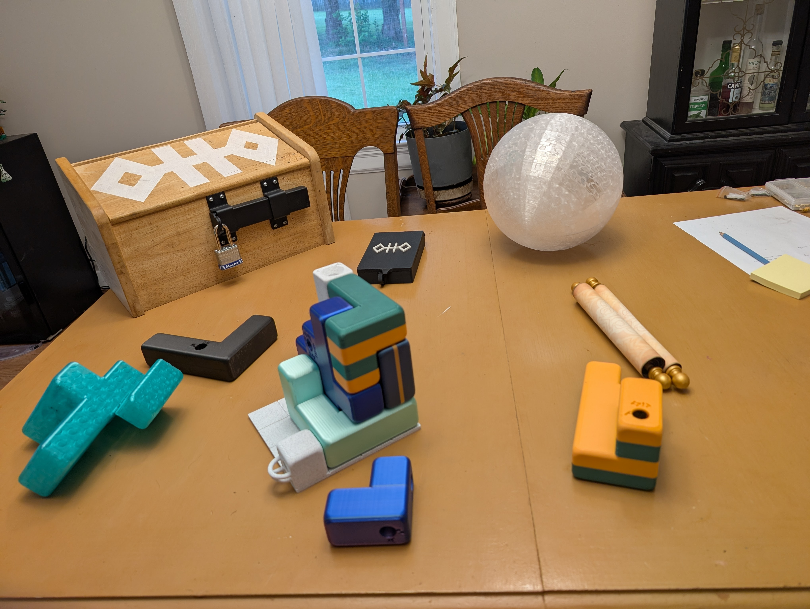
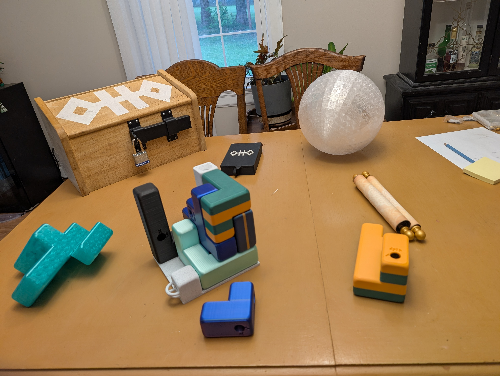
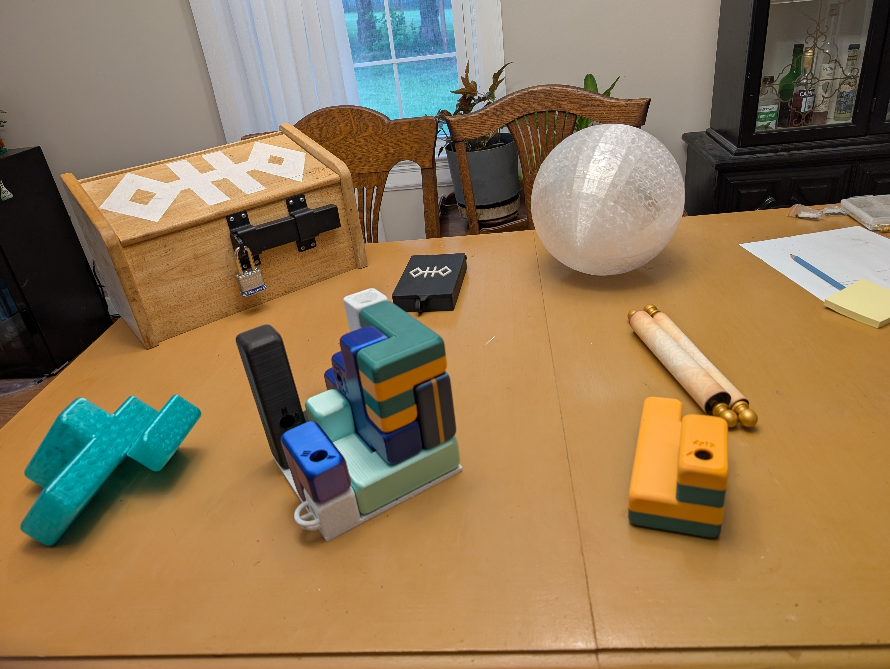
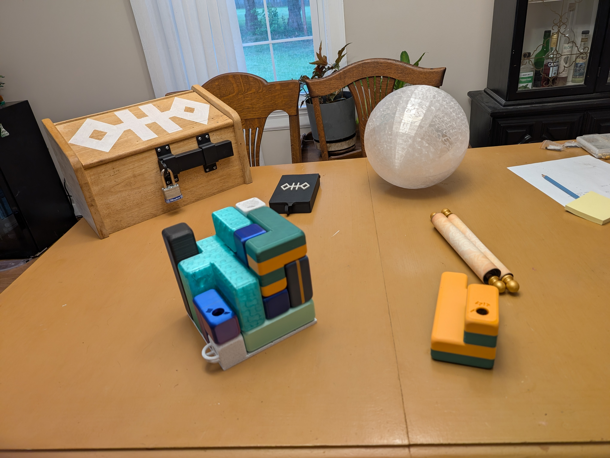
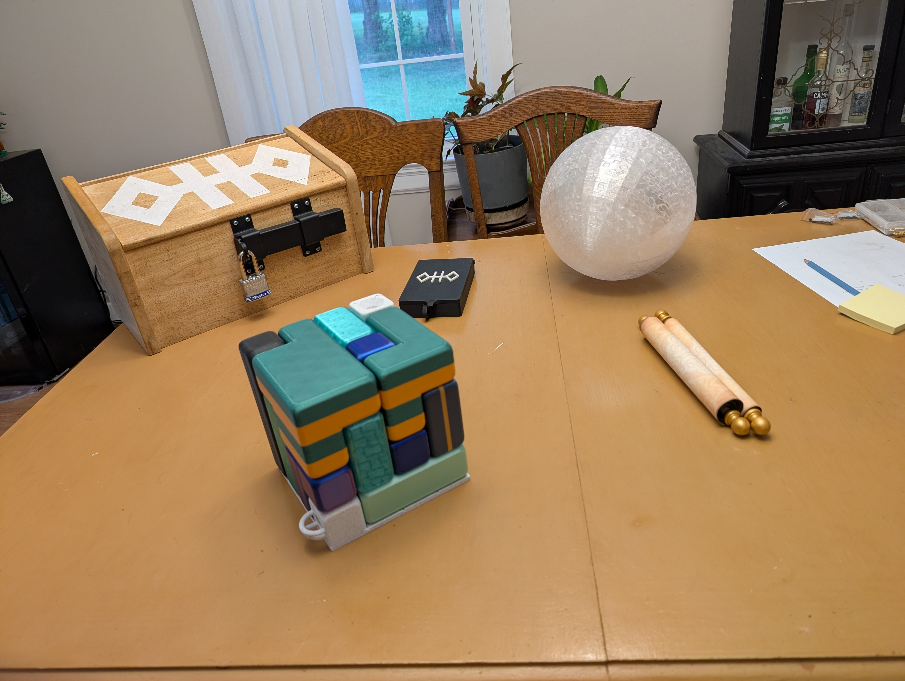

## Result

I'm quite, quite pleased with this puzzle. I can think of many fun variations to try, with even more complex pathways for a smaller marble to run, with loop de loops and corkscrews and lots of fun! Maybe a version where the whole cube must be picked up and rotated! Hiding magnets in the pieces to make them snap together would also be hugely satisfying. 

