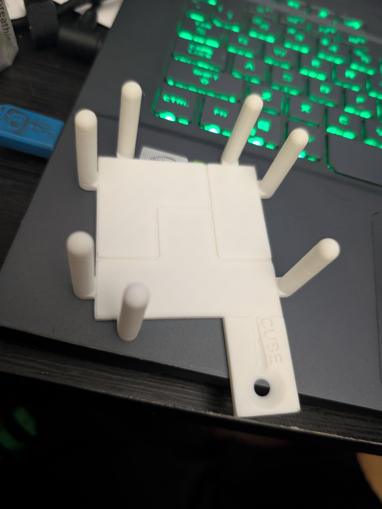
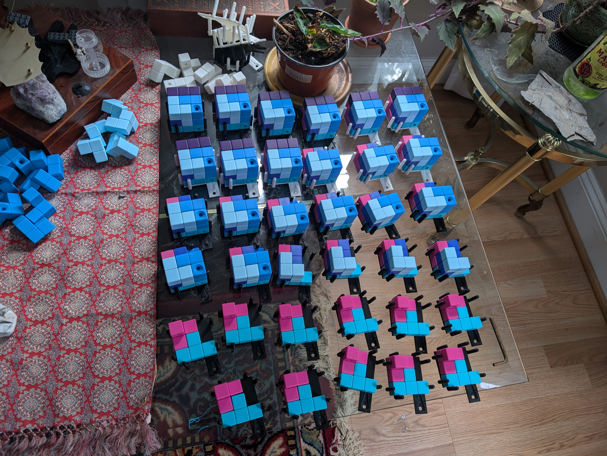

## Problem
Gotham Immersive Labs asked me to adapt my Rune Cube puzzle for a corporate event. They asked for it to be smaller, and solve in 10-15 mins on average. Essentially, design and build a 3d puzzle where solvers will assemble pieces into a cube, where then a ball bearing can run through the entire assembly.
## Process
Well I watched a few teams take around an hour assembling the Rune Cube, so I knew I was going to have to dramatically change the design. Instead of redesigning pieces completely, I decided to play with the idea of a [SOMA Cube](https://en.wikipedia.org/wiki/Soma_cube). These suckers can be constructed in a grand total of two hundred and forty unique ways! Using some lessons I had learned making the Rune Cube, I quickly modeled the SOMA pieces and designed the circular path meandering through all seven of the pieces.

Gotham came up with the symbols for me to put on the pieces. "FAMOUSEIGHTHST" with "CUBE" on the base clued the solvers in to the 'famous' 'cube' on 'eighth' 'st,' the [Alamo](https://en.wikipedia.org/wiki/Alamo_%28sculpture%29)! Letters were far easier to emboss into these cubes than the hand drawn shapes on the rune cube. After doing some testing and finding that people were still taking a while to assemble the cube, I embossed the bottom shapes of the pieces onto the base. This proved to get people to assemble the cube in perfect time! The base also helps give the players something to build on, and keeps the cube packed nicely together so the ball bearing doesn't get stuck.

Due to a very tight turnaround for this event, I also provided printing services for this puzzle. My Bambu X1-C was running non-stop for two weeks to build 36 cubes!

I also generated an assembly video to add to their hint section, which should give you a great idea of how the puzzle works!

## Result
Since I got to fab this myself, I got to pick out some wonderful colors for all of the pieces. And watch how smoothly it runs!

I got the cubes shipped up to NYC, and they were very much enjoyed!
After the fact I printed another one just for me to puzzle my friends with, of course.