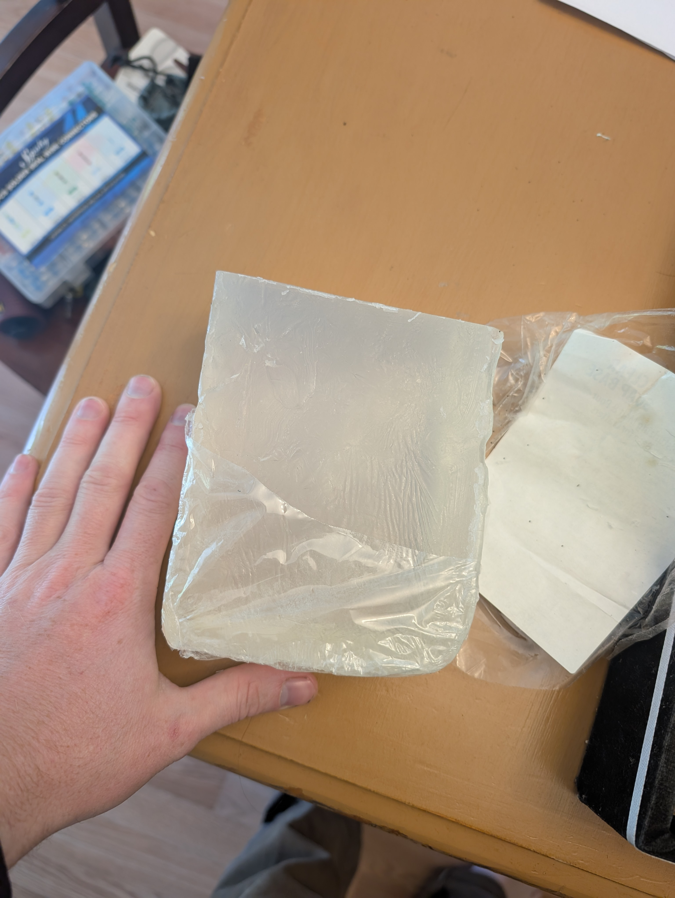
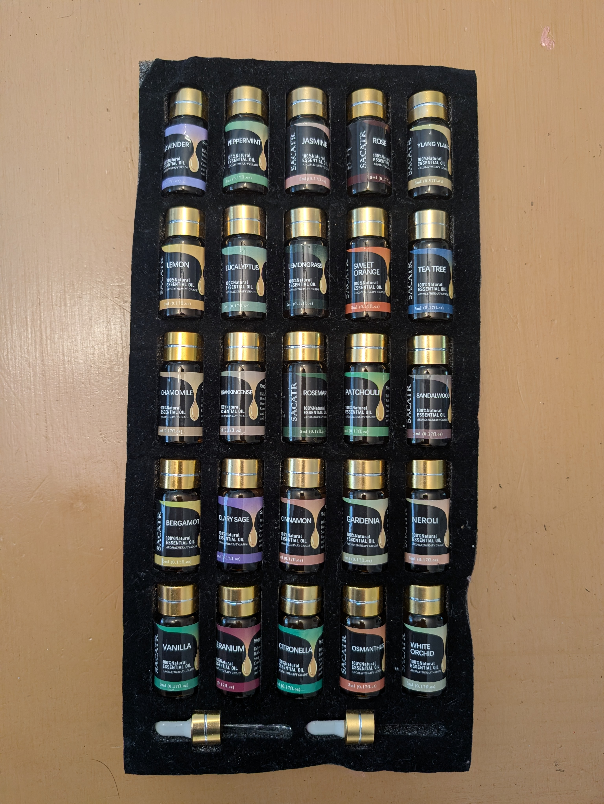
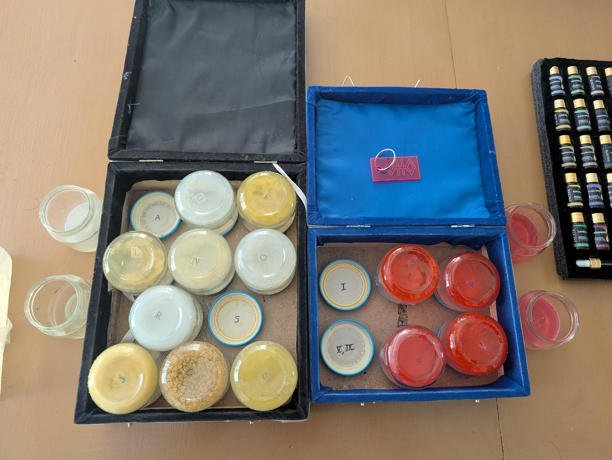
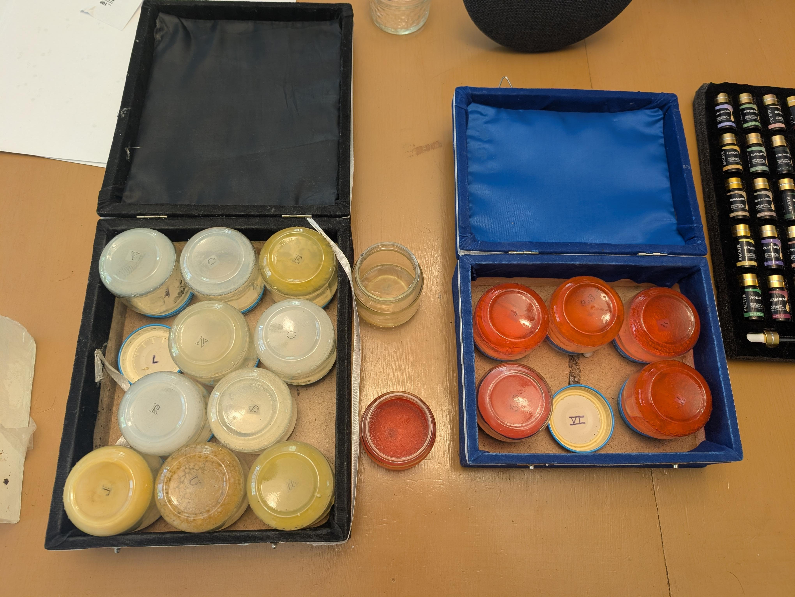

## Problem
I challenged myself to make a puzzle using scents hidden around campus!
## Process
After doing some research and trial and error, I found that I could melt essential oils into nonscented soap, and make my own very fragrant soaps!

I found that leaving the soaps in an open container together caused all of the scents to mix. I considered small mason jars, and a friend recommended that baby food containers would be a perfect size! I challenged the poor VT Hunt team to help me consume 17 truly horrible baby foods - no food waste in my home!

By gluing the lids of the containers down inside boxes, the solver can unscrew the bottles, take a sniff, and reseal. They still have strong, distinct scents over two years later!

The puzzle functioned with two boxes as a metaphorical lock and key. The large box with eleven scents has a letter associated with each scent, while the smaller box with red soaps had numerical values for each soap. Hunters quickly realized they needed to match scents from one box to another - if soap M matched the scent of soap 3, then the third letter of the solution word was an M!

A few more considerations were made. The boxes were affixed at opposite ends of the tallest stairwell on campus - a gruelling six story climb. This would ensure teams had to coordinate, with two groups of sniffers communicating over what scents they could determine. One can only run up and down those stairs so many times in an afternoon! This location was also ideal for its immediate proximity to a coffee shop, where solvers could pop in to refresh their scent buds. Finally - and diabolically - all of the scents were lovely essential oils... except for one visually indistinguishable fart scented bomb!

## Result
The process for crafting this puzzle was a blast. Learning the best way to make distinguishable scents, hiding slight color variations by dying a set, learning exactly how long to heat the soap to infuse it (and add a paper letter!)... creating physical challenges has become by far my favorite form of puzzle making.

This puzzle frustrated many of the hunters who preferred classical puzzle mechanics, and it delighted those who wanted to see something new. Having made many puzzle hunts now, I find the VT Hunt is strongest when there is a good mix of classic puzzles and physical challenges like this one.

I still have this one squirreled away if you want to try it!

